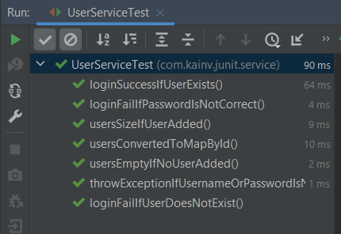

JUnit 5. 8. Testing exceptions
==============================

Посмотрим, как можем проверить исключительные ситуации. Т.е. когда мы в наших методах пробрасываем какие-то исключения и мы хотим их как-то отловить и протестировать. Это должно быть ожидаемое поведение, что приложение пробросит исключение.

Например, у нас есть функция `login()` в `UserService` и напишем тест, который проверяет, что этот метод пробрасывает исключение, если к примеру передали null в username или password. В таком случае пишем:

**UserServiceTest.java**

        @Test
        void throwExceptionIfUsernameOrPasswordIsNull() {
            try {
                userService.login(null, "some password");
    //            тест не прошёл
                fail("login should throw exception on null username");
            } catch (IllegalArgumentException ex) {
    //            тест прошел, если исключение отработало
                assertTrue(true);
            }
        }

Если зайдём в исходники ассертов, то в итоге, в конечном методе увидим именно пробрасывание исключений. Т.е., все ассерты - это всего лишь пробрасывание исключений. Все эти исключения - это `AssertionFailedError`'ы которые наследуются от `AssertionError`, а они в свою очередь наследуются от обычного `Error`, который наследует `Throwable`.

Теперь пишем функционал, в котором метод `login()` в `UserService` будет пробрасывать исключение:

**UserService.java**

    public Optional<User> login(String username, String password) {
        if (username == null || password == null) {
            throw new IllegalArgumentException("username or password is null");
        }
        return users.stream()
                .filter(user -> user.getUsername().equals(username))
                .filter(user -> user.getPassword().equals(password))
                .findFirst();
    }

Запускаем тест и проверяем, что он проходит:

Если бы мы хотели проверить несколько кейсов. Например, то, что передаём не только username null, а и password, то нам нужно было бы использовать ещё один try-catch либо второй тест писать, что не очень удобно. Хотелось бы что-то вроде ассертов как делали в случае проверки нашей Map и тогда в `assertAll` запихнули бы сразу два тест-кейса чтобы не плодить множество тест-методов. Как раз таки для этого есть специальный ассерт в JUnit 5 и этот ассерт называется `assertThrows()`, в который передаём исключение, которое ожидаем получить:

**UserServiceTest.java**

    @Test
    void throwExceptionIfUsernameOrPasswordIsNull() {
        assertThrows(IllegalArgumentException.class, () -> userService.login(null, "some password"));
    }

Более того, т.к. теперь можем проверить два тест-кейса потому что это всего лишь один ассерт, то следственно можем написать `assertAll()`:

**UserServiceTest.java**

    @Test
    void throwExceptionIfUsernameOrPasswordIsNull() {
        assertAll(
                () -> assertThrows(IllegalArgumentException.class, () -> userService.login(null, "some password")),
                () -> assertThrows(IllegalArgumentException.class, () -> userService.login("some username", null))
        );
    }

Такой функционал был в последних версиях JUnit 4, но до него мы могли проверить тип исключения только при помощи аннотации `@org.junit.Test(excepted = Exception.class)`. В нашем случае, если делаем `assertThrows`, то он ещё и возвращает исключение и можем дальше проверять его. Например, проверием исключение на сообщение:

**UserServiceTest.java**

    @Test
    void throwExceptionIfUsernameOrPasswordIsNull() {
        assertAll(
                () -> {
                    IllegalArgumentException argumentException = assertThrows(IllegalArgumentException.class, () -> userService.login(null, "some password"));
                    assertThat(argumentException.getMessage()).isEqualTo("username or password is null");
                },
                () -> assertThrows(IllegalArgumentException.class, () -> userService.login("some username", null))
        );
    }