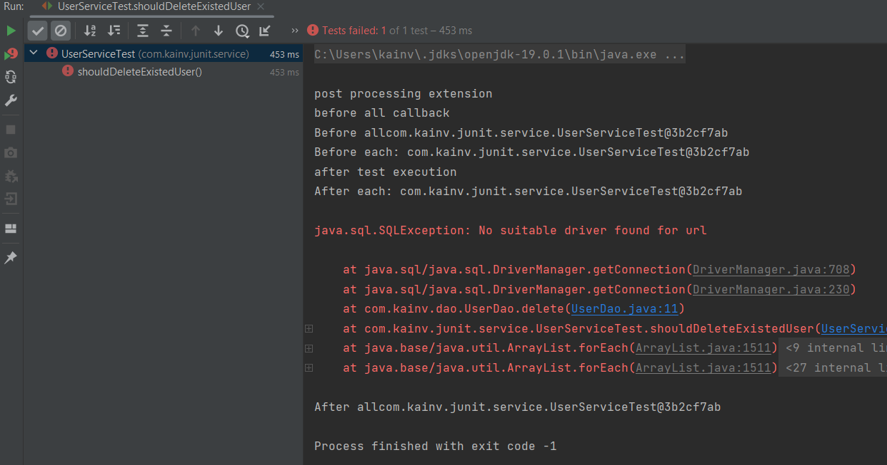
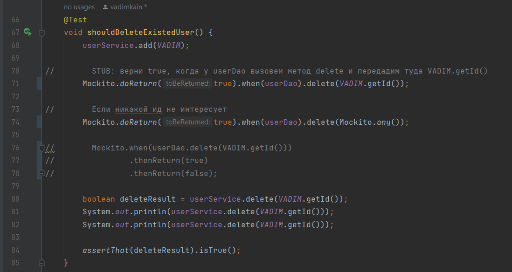
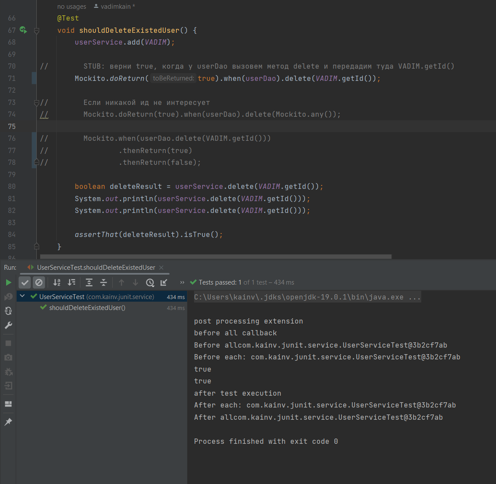
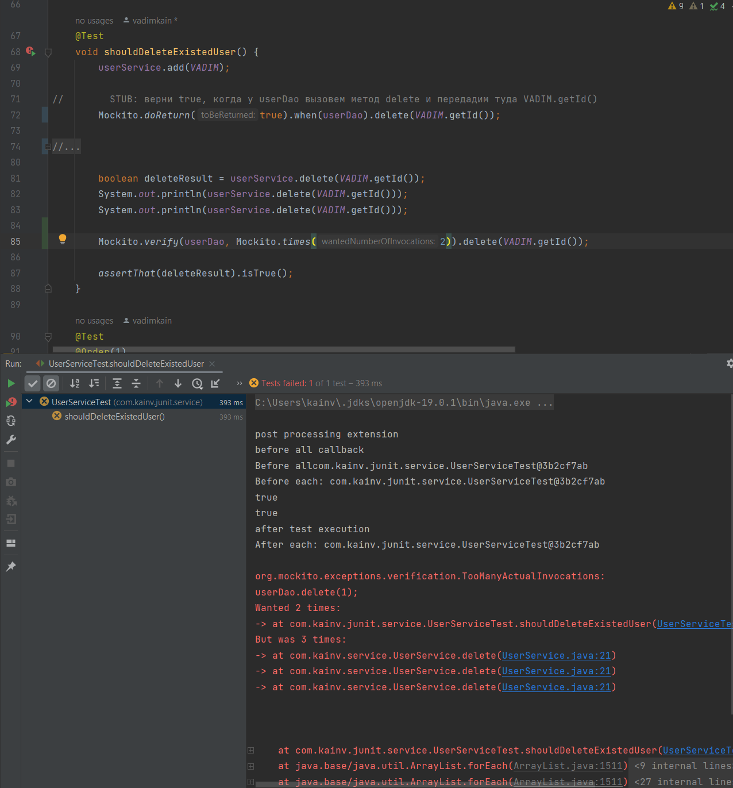
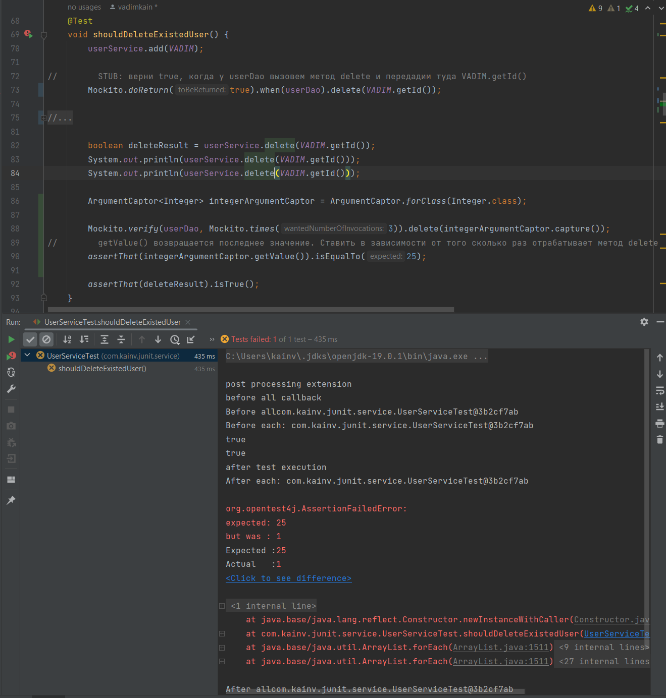

JUnit 5. 18. Mockito. Spy
=========================

Увидим на примере Spy, что более предпочтителен вариант `Mockito.doReturn(true).when(userDao).delete(Mockito.any());`, а не `Mockito.when(userDao.delete(VADIM.getId())).thenReturn(true).thenReturn(false);` потому что он является более гибким. **Spy** - это тот же mock, но он содержит в себе реальный объект `UserDao` и мы также его можем программировать с помощью мокито.

Посмотрим как это делается
--------------------------

Для начала создадим `UserDaoSpy` и как мы видили - у нас есть два варианта создания прокси в java, в этот раз мы сделаем то же самое - через наследование. В спецификации указано, что есть ещё один вариант создания моков, которые могут обойти ограничения с final в `UserDao` т.е. работают не через extends, но пока что это не используется в реальных приложениях.

Теперь, делаем то же самое, что и в `UserDaoMock` и плюс ко всему у нас будет реальный объект. Т.е. `private final UserDaoo userDao;`. И в этот раз, если у нас нет в `answer` т.е. мы не запрограммировали наш `UserDaoSpy`, то просто обращаемся к `userDao` и у него вызываем реальный метод. Вызов `userDao.delete()` должен быть lazy и не вызываться, если есть answer:

    package com.kainv.junit.dao;
    
    import com.kainv.dao.UserDao;
    import org.mockito.stubbing.Answer1;
    
    import java.util.HashMap;
    import java.util.Map;
    
    public class UserDaoSpy extends UserDao {
        private final UserDao userDao;
        private Map<Integer, Boolean> answers = new HashMap<>();
        private Answer1<Integer, Boolean> answer1;
    
        public UserDaoSpy(UserDao userDao) {
            this.userDao = userDao;
        }
    
        @Override
        public boolean delete(Integer userId) {
            return answers.getOrDefault(userId, userDao.delete(userId));
        }
    }

Чтобы проверить возвращаемся в `UserServiceTest`, метод `void prepare()` и в этот раз вместо метода `Mockito.mock()` вызываем `Mockito.spy()` куда передаём уже реальный объект:

**UserServiceTest.java**

    @BeforeEach
    void prepare() {
        System.out.println("Before each: " + this);
        this.userDao = Mockito.spy(new UserDao());
        this.userService = new UserService(userDao);
    }

Если запустим, то получим ошибку поскольку использовали второй вариант создания Stub'ов.

Это связано с тем, что мы вызвали реальный метод из-за того, что использовали второй вариант который не гибкий. В случае моков - он прокатывал потому что он и так не содержит реальный объект в себе и не вызывает у него метод. В этом случае мы ещё не запрограммировали метод `delete()` у нашего Spy поэтому он вызвался. Следственно, **предпочтительнее** использовать первый вариант, где метод по сути не вызывается у нашего реального объекта.

Т.е. мы сначала передаём в `.when()` объект `userDao`, а потом уже в обёртке (т.е. у прокси) мы вызываем метод (`.delete()`) тем самым избегаем прямого вызова метода у нашего реального объекта до тех пор, пока он не запрограммирован. Таким образом, `Mockito.doReturn()` является более предпочтительным.

В этот раз тест прошёл. Вот и единственное отличие mock'ов от spy'ев.

Что ещё мокито предоставляет нам
--------------------------------

### verify()

У нас есть возможность вызвать у мокито метод `verify()` и передать туда mock. Т.е. мы проверяем сколько раз вызвался метод у определённого мока. Т.е. в нашем случае:

**UserServiceTest.java**

        @Test
        void shouldDeleteExistedUser() {
            userService.add(VADIM);

    //        STUB: верни true, когда у userDao вызовем метод delete и передадим туда VADIM.getId()
            Mockito.doReturn(true).when(userDao).delete(VADIM.getId());

    //        Если никакой ид не интересует
    //        Mockito.doReturn(true).when(userDao).delete(Mockito.any());

    //        Mockito.when(userDao.delete(VADIM.getId()))
    //                .thenReturn(true)
    //                .thenReturn(false);

            boolean deleteResult = userService.delete(VADIM.getId());
            System.out.println(userService.delete(VADIM.getId()));
            System.out.println(userService.delete(VADIM.getId()));

            Mockito.verify(userDao).delete(VADIM.getId());

            assertThat(deleteResult).isTrue();
        }

По умолчанию проверяет, что один раз у `userDao` был вызван метод `.delete()`. Если это не так, то будет ошибка. Если хотим сделать проверку на то, что вызвался несколько раз, то есть второй параметр - это `VerificationMode mode`. Мы можем также использовать класс Mockito и передать `Mockito.verify(userDao, Mockito.atList(2)).delete(VADIM.getId());`, т.е. как минимум два раза был вызван. Если нужно конкретно, то передаём`Mockito.verify(userDao, Mockito.times(2)).delete(VADIM.getId());`

У нас выпало исключение потому что ожидали два раза вызов метода `delete()`, а вызвалось три. Таким образом мы через `Mockito.verify()` можем проверять сколько раз вызвался метод у нашего мока. Т.е. по сути как шпион перехватывает методы и спокойно сохраняет кол-во вызовов, что также легко реализовать в нашем `UserDaoSpy`. Т.е. кол-во `invocation`'ов каждого метода мы можем просто делать как счётчик и тут его инкрементировать.

Если ожидаем, что не будут никаких вызовов наших моков, то у мокито есть метод `Mockito.verifyNoInteractions()` куда передаём все моки через массив.

Более того, механизм verify нам позволяет использовать ещё один функционал у мокито - это _argument capture_. Т.е. можем посмотреть что было вызвано у нашего мока внутри нашего метода `delete()`. Например, можем что-то подделать внутри этого метода:

**UserService.java**

    public boolean delete(Integer userId) {
        Integer userIdLocal = 25;
        return userDao.delete(userIdLocal);
    }

Именно arument capture позволяет нам отловить что именно было вызвано с каким аргументом метод `delete()` у нашего мока. Потому что очень часто мы не проксируем наши параметры как в нашем случае метод `delete()`, а что-то с ними делаем внутри нашего сервиса, а уже в сервисе идёт какая-то бизнес-логика которая со своими параметрами передаёт у наших зависимых классов вызывая их методы. Таким образом мы можем посмотреть с какими именно аргументами мы вызвали метод у наших моков.

Поэтому, возвращаясь в `UserServiceTest` мы можем сделать следующим образом:

**UserServiceTest.java**

        @Test
        void shouldDeleteExistedUser() {
        userService.add(VADIM);

        //        STUB: верни true, когда у userDao вызовем метод delete и передадим туда VADIM.getId()
        Mockito.doReturn(true).when(userDao).delete(VADIM.getId());

        //        Если никакой ид не интересует
        //        Mockito.doReturn(true).when(userDao).delete(Mockito.any());

        //        Mockito.when(userDao.delete(VADIM.getId()))
        //                .thenReturn(true)
        //                .thenReturn(false);

        boolean deleteResult = userService.delete(VADIM.getId());
        System.out.println(userService.delete(VADIM.getId()));
        System.out.println(userService.delete(VADIM.getId()));

        ArgumentCaptor<Integer> integerArgumentCaptor = ArgumentCaptor.forClass(Integer.class);

        Mockito.verify(userDao, Mockito.times(2)).delete(integerArgumentCaptor.capture());

        assertThat(deleteResult).isTrue();
        }

Т.е. после уже вызова метода `userService.delete(VADIM.getId());` который собственно и проверяем тестируя - мы создаём `ArgumentCaptor<Integer>` и вызываем метод `integerArgumentCaptor.capture()` который захватывает метод `delete()`, а точнее его аргументы все и в последующем мы можем их получить следующим образом:

        @Test
        void shouldDeleteExistedUser() {
            userService.add(VADIM);
    
    //        STUB: верни true, когда у userDao вызовем метод delete и передадим туда VADIM.getId()
            Mockito.doReturn(true).when(userDao).delete(VADIM.getId());
    
    //        Если никакой ид не интересует
    //        Mockito.doReturn(true).when(userDao).delete(Mockito.any());
    
    //        Mockito.when(userDao.delete(VADIM.getId()))
    //                .thenReturn(true)
    //                .thenReturn(false);
    
            boolean deleteResult = userService.delete(VADIM.getId());
            System.out.println(userService.delete(VADIM.getId()));
            System.out.println(userService.delete(VADIM.getId()));
    
            ArgumentCaptor<Integer> integerArgumentCaptor = ArgumentCaptor.forClass(Integer.class);
    
            Mockito.verify(userDao, Mockito.times(2)).delete(integerArgumentCaptor.capture());
    //        getValue() возвращается последнее значение. Ставить в зависимости от того сколько раз отрабатывает метод delete
            assertThat(integerArgumentCaptor.getValue()).isEqualTo(25);
    
            assertThat(deleteResult).isTrue();
        }

Таким образом можем перехватить все аргументы которые были переданы в наш Mock, но в данном случае у нас было 25 следственно будем ожидать, что будет значение 25. Поправим метод `delete()` в `UserService`:

**UserService.java**

    public boolean delete(Integer userId) {
        return userDao.delete(userId);
    }

А так же `Mockito.verify(userDao, Mockito.times(2)).delete(integerArgumentCaptor.capture());` из 2 поставим 3: `Mockito.verify(userDao, Mockito.times(3)).delete(integerArgumentCaptor.capture());` поскольку метод `delete()` вызывается три раза и запускаем тест:

Наш тест упал уже с ожидаемой ошибкой. Т.е. ожидалось 25, а получили 1. Всё верно. Мы отловили `ArgumentCaptore` значение и он отловил что там, было передано 1, хотя ожидали 25. Таким образом через `ArgumentCaptore` мы можем отлавливать внутри что происходит у нашего `UserService`. Таким образом можем протестировать всю логику нашего метода в не зависимости от того что у нас куча моков на наши зависимые классы.