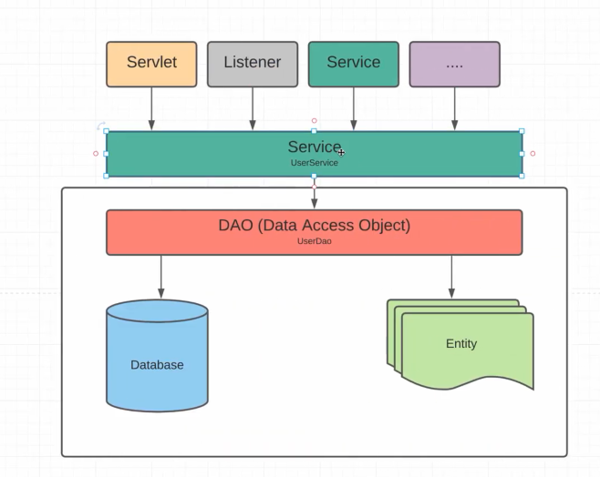
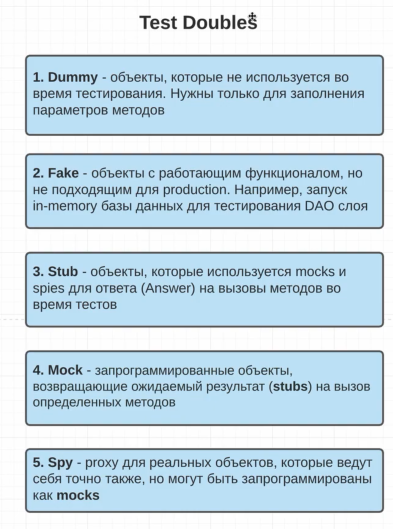
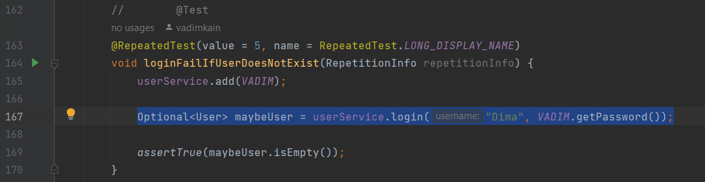

Junit 5. 16. Mockito. Test Doubles
==================================

На предыдущих занятиях мы писали наши тесты на основании `UserService`. Т.е. писали именно unit-тесты проверяя лишь какой-то метод в нашем `UserService`. Но мы пошли очень простым путём, мы всего лишь создали список наших пользователей и у нашего `UserService` не было зависимости на другие сервисы либо, к примеру, `UserDao` который бы обращался в базу данных и получал бы значения. В таком случае у нас уже был бы не юнит тест, а интеграционный тест. Потому что тестируя к примеру метод `add()` в `UserService` - мы бы обращались ещё к `UserDao` который выполнял бы метод `insert()` в базу данных.

На практике такие варианты встречаются чаще всего. Поэтому у нас происходит следующее:

Наш `UserService` будет обращаться к `UserDao` или другим сервисам и следовательно, для того чтобы написать наши юнит тесты, а не интеграционные тесты - мы должны каким-то образом не взаимодействовать с реальными объектами других сервисов и Dao потому что хотим протестировать только функционал нашего `UserService`. Именно здесь на помощь приходит фреймворк **Mockito**, который позволяет нам делать что-то вроде заглушек на зависимые классы. Т.е. на другие сервисы и классы чтобы не вызывать реальные эти объекты.

Для того чтобы лучше понять Mockito, нам необходимо разобраться с подставными объектами, что они из себя представляют. Следственно, у нас есть специальное определение, которое называется **Test Doubles**, которое можно переводить как дублёры. Т.е. какой-то второй объект, который пришел нам на замену настоящего.

1.  **Dummy** - это объекты, которые не используются во время тестирования. Нужны только для заполнения параметров методов.

    Например, когда тестируем наш метод `login()`, нас может не интересовать какие мы username ввели, какие пароли, чтобы пройти аутентификацию. Следственно, нам всё равно что это за объекты будут. Мы их создаём только для того чтобы мы могли вызвать наш метод `login()` как это делали в наших тестах.

    

    Как в этом коде - нас не интересовал какой username, мы передали выдуманный объект. Mockito предоставляет более удобный функционал для этого.

2.  **Fake** - объекты с работающим функционалом, но не подходящим для production. Например, запуск in-memory базы данных для тестирования DAO слоя.

    Т.е. у нас есть реальная база данных, но для тестирования мы не хотим поднимать реальную, мы можем понять фейковую БД и на ней проверять тесты.

    В нашем случае мы создавали Вадимов и Петь для того чтобы к примеру добавить нашего пользователя в систему (`userService.add(VADIM);`).

3.  **Stub** - объекты, которые используются **mocks** и **spies** для ответа (Answer) на вызовы методов во время тестов.

    Это всего лишь объект, который должен вернуться если мы у наших других объектов (mocks & spies) вызовем какой-то метод с определенными параметрами.

4.  **Mock** - запрограммированные объекты, возвращающие ожидаемый результат (**stubs**) на вызов определенных методов.

    Т.е. по сути у нас есть к примеру `UserService`, но мы подставляем какой-то mock-объект `UserService`'а и мы можем его использовать везде где его использовали `UserService`, но как он будет функционировать. Т.е. как будет реагировать на вызов метода логина, добавления и прочее мы будем сами программировать используя какие-то параметры на вход наших методов и stub'ы, для того чтобы вернуть какие-то значения из наших методов.

5.  **Spy** - proxy для реальных объектов, которые ведут себя точно также, но могут быть запрограммированы как **mocks**.

    Т.е. по сути создаём **spy** на основании нашего реального `UserService`'а и до тех пор, пока мы не начали его программировать, как-то настраивать его поведения как это делали в mock'ах (т.е. на вызов определенного метода с определенными параметрами) - мы должны вернуть **stubs** не вызывая настоящий метод.

Подключим библиотеку Mockito
----------------------------

**pom.xml**

        <dependency>
            <groupId>org.mockito</groupId>
            <artifactId>mockito-core</artifactId>
            <version>3.9.0</version>
            <scope>test</scope>
        </dependency>