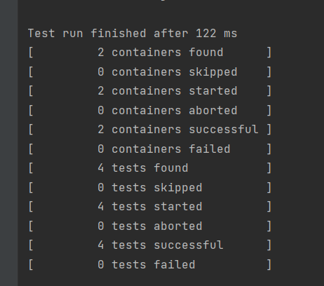
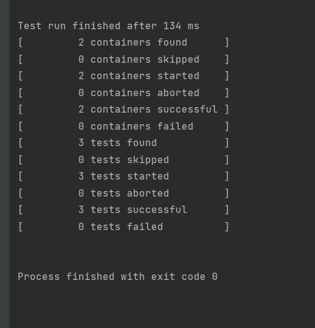
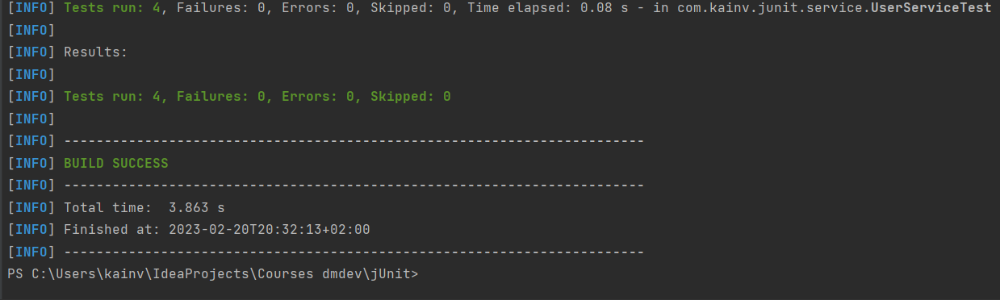
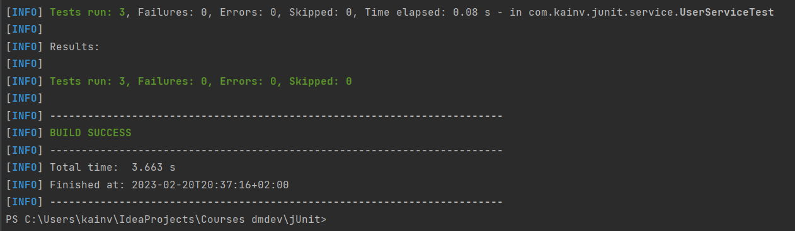
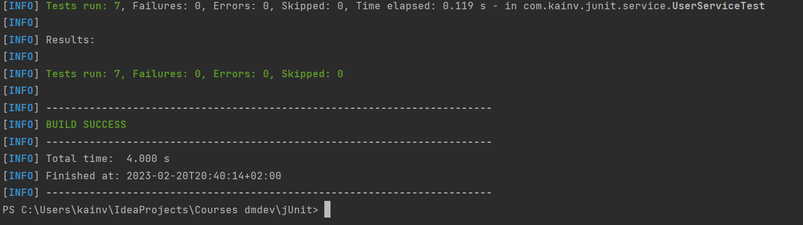

JUnit 5. 9. Tagging and Filtering
=================================

Тэги - это новая функциональность в JUnit 5, благодаря которой можем отфильтровывать наши тесты. Эта аннотация так и называется: `@Tag` (`@Tags` позволяет совмещать несколько тегов над одним методом или классом). Аннотация `@Tag` принимает одно значение - `values`.

Поставим тег над тестами, которые относятся к логину:

    package com.kainv.junit.service;

    import com.kainv.dto.User;
    import com.kainv.service.UserService;
    import org.hamcrest.MatcherAssert;
    import org.hamcrest.collection.IsEmptyCollection;
    import org.hamcrest.collection.IsMapContaining;
    import org.junit.jupiter.api.\*;

    import java.util.List;
    import java.util.Map;
    import java.util.Optional;

    import static org.assertj.core.api.Assertions.assertThat;
    import static org.junit.jupiter.api.Assertions.\*;

    @TestInstance(TestInstance.Lifecycle.PER\_CLASS)
    public class UserServiceTest {

        private UserService userService;
        private static final User VADIM = User.of(1, "Vadim", "123");
        private static final User PETR = User.of(2, "Petr", "123");

        @BeforeAll
        void init() {
            System.out.println("Before all" + this);
        }

        @BeforeEach
        void prepare() {
            System.out.println("Before each: " + this);
            userService = new UserService();
        }

        @Test
        void usersEmptyIfNoUserAdded() {
            System.out.println("Test 1: " + this);

            List<User> users = userService.getAll();

            MatcherAssert.assertThat(users, IsEmptyCollection.empty());
            assertTrue(users.isEmpty(), () -> "User list should be empty");
        }

        @Test
        void usersSizeIfUserAdded() {
            System.out.println("Test 2: " + this);

            userService.add(VADIM);
            userService.add(PETR);

            // Делаем проверку на кол-во пользователей в приложении
            List<User> users = userService.getAll();

            assertThat(users).hasSize(2);
    //        assertEquals(2, users.size());
        }

        @Test
        @Tag("login")
        void loginSuccessIfUserExists() {
            userService.add(VADIM);
            userService.add(PETR);

            Optional<User> maybeUser = userService.login(VADIM.getUsername(), VADIM.getPassword());

            // Проверяем, что такой пользователь существует
            assertThat(maybeUser).isPresent();
    //        assertTrue(maybeUser.isPresent());
            // Проверяем, действительно ли это тот пользователь (первый параметр - ожидаемый, второй - фактический)
            maybeUser.ifPresent(user -> assertThat(user).isEqualTo(VADIM));
    //        maybeUser.ifPresent(user -> assertEquals(VADIM, user));
        }

        @Test
        @Tag("login")
        void throwExceptionIfUsernameOrPasswordIsNull() {
            assertAll(
                    () -> {
                        IllegalArgumentException argumentException = assertThrows(IllegalArgumentException.class, () -> userService.login(null, "some password"));
                        assertThat(argumentException.getMessage()).isEqualTo("username or password is null");
                    },
                    () -> assertThrows(IllegalArgumentException.class, () -> userService.login("some username", null))
            );
        }

        @Test
        @Tag("login")
        void loginFailIfPasswordIsNotCorrect() {
            userService.add(VADIM);

            Optional<User> maybeUser = userService.login(VADIM.getUsername(), "incorrect");

            assertTrue(maybeUser.isEmpty());
        }

        @Test
        void usersConvertedToMapById() {
            userService.add(VADIM, PETR);

            Map<Integer, User> users = userService.getAllConvertedById();

            MatcherAssert.assertThat(users, IsMapContaining.hasKey(VADIM.getId()));

            assertAll(
                    () ->
                            // В результирующей коллекции проверяем на содержание ID для Вадима и Петра
                            assertThat(users).containsKeys(VADIM.getId(), PETR.getId()),
                    () ->
                            // Проверяем Map не только на содержание, но и значений
                            assertThat(users).containsValues(VADIM, PETR)
            );
        }

        @Test
        @Tag("login")
        void loginFailIfUserDoesNotExist() {
            userService.add(VADIM);

            Optional<User> maybeUser = userService.login("Dima", VADIM.getPassword());

            assertTrue(maybeUser.isEmpty());
        }

        @AfterEach
        void deleteDataFromDatabase() {
            System.out.println("After each: " + this);
        }

        @AfterAll
        void closeConnectionPool() {
            System.out.println("After all" + this);
        }
    }

Такая возможность позволяет запускать только те тесты, которые помечены тэгом login. Либо например очень часто встречается такая возможность как запускать только те тесты, которые к примеру только unit:

    @Tag("fast")
    @TestInstance(TestInstance.Lifecycle.PER\_CLASS)
    public class UserServiceTest {

А интеграционные и Acceptance тесты будут помечены другими тегами. Особенно эти теги играют решающую роль для сложных тестов (Acceptance тестов), которые занимают довольно большую часть времени. И, следовательно, очень удобно запускать только те тесты, которые относятся к определенной предметной области, которую тестируем или на которой пишем тесты.

Например, у нас есть большая функциональность на нашего пользователя. Следственно, все тесты которые помечены тэгом `@Tag("user")` нам нужно запускать и проверять. Это нам спасает очень большое кол-во времени для тестировщика:

    @Tag("fast")
    @Tag("user")
    @TestInstance(TestInstance.Lifecycle.PER\_CLASS)
    public class UserServiceTest {

Разберёмся как запускать тесты по тегам
---------------------------------------

Если перейдём в класс `TestLauncher` где проверяли как вручную запускать тесты. Т.е. то что делают наши среды разработки и build-tools вроде maven'а и gradle'а под капотом. В данном случае видим, что у нас есть ещё один метод `.filters` и мы можем в него передавать различные фильтры. Чаще всего используются такие фильтры как _include_ и _exclude_ по префиксу или суффиксу. Так же можно использовать `TagFilter` в котором можно включать и исключать определенные тэги.

Например, я хочу запускать только те теги, которые помечены login:

    public class TestLauncher {
        public static void main(String\[\] args) {
            Launcher launcher = LauncherFactory.create();

    //        launcher.registerLauncherDiscoveryListeners();
    //        launcher.registerTestExecutionListeners();

            SummaryGeneratingListener summaryGeneratingListener = new SummaryGeneratingListener();

            LauncherDiscoveryRequest request = LauncherDiscoveryRequestBuilder
                    .request()
    //                Указываем, где наш request будет искать наши тесты
    //                .selectors(DiscoverySelectors.selectClass(UserServiceTest.class))
                    .selectors(DiscoverySelectors.selectPackage("com.kainv.junit.service"))
                    .filters(
                            TagFilter.includeTags("login")
                    )
                    .build();

            launcher.execute(request, summaryGeneratingListener);

    //        Выводим результат тестирования
            try (PrintWriter writer = new PrintWriter(System.out)) {
                summaryGeneratingListener.getSummary().printTo(writer);
            }
        }
    }

Теперь, если запустим main, то выполнятся только тесты, которые отмечены как login:

Если обратимся к `.excludeTags("login")`, то выполнятся все которые не помечены login:

**TestLauncher.java, main()**

        LauncherDiscoveryRequest request = LauncherDiscoveryRequestBuilder
                .request()
//                Указываем, где наш request будет искать наши тесты
//                .selectors(DiscoverySelectors.selectClass(UserServiceTest.class))
.selectors(DiscoverySelectors.selectPackage("com.kainv.junit.service"))
.filters(
TagFilter.excludeTags("login")
)
.build();

Если же хотим запустить через командную строку, то в maven есть специальная JVM опции, которые позволяют передавать флаги через флаг -D: `mvn clean test -Dgroups=login`:

А чтобы исключить тег, передаём флаг `mvn clean test -DexcludedGroups=login`:

Запустим только те тесты, которые помечены тегом fast: `mvn clean test -Dgroups=fast`

