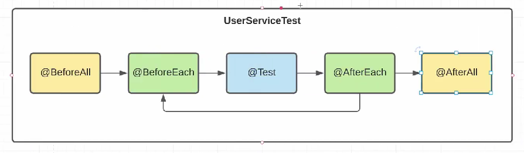
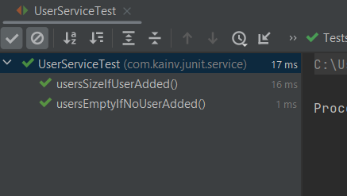
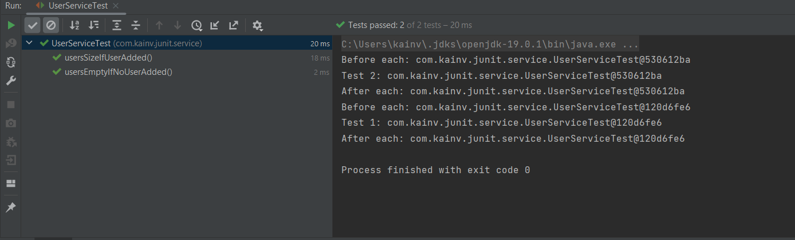
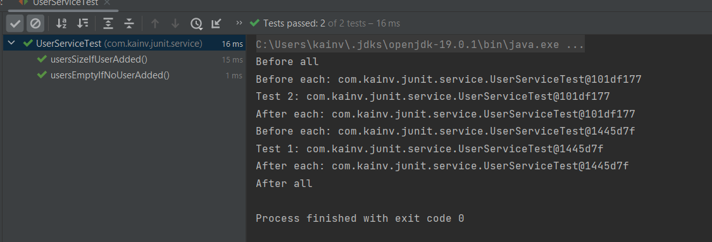
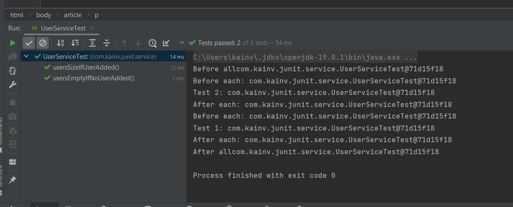

JUnit 5. 4. Test Lifecycle
==========================

Познакомимся с жизненным циклом тестов.

Когда пишем тесты в нашем `UserServiceTest`, то в этом классе у нас может быть множество таких тестов. Мы просто пишем методы и помечаем их аннотациями `@Test`. Но также нам часто надо что-то предустановить и почистить после выполнения тестов. Следственно, для этого можем написать соответствующие методы и пометить их аннотациями:

*   `@BeforeEach` - если хотим что-то предустановить перед тестами.
*   `@AfterEach` - если хотим почистить после каждого теста.

Следственно, сколько будет тестов в классе, столько раз будет происходить вызов цикла `@BeforeEach` -> `@Test` -> `@AfterEach`. Если что-то хотим предустановить перед всеми вызовами этих тестов и почистить после них, то для этого есть аннотации `@BeforeAll` и `@AfterAll`.

Отсюда получается жизненный цикл: сначала вызывается `@BeforeAll` перед всеми тестами -> далее происходит вызов всех наших тестов по циклу, при чем порядок не гарантирован. **Не следует** писать тесты полагаясь на вызов других тестов, наши тесты **должны быть** независимы друг от друга. Поэтому происходит череда вызовов тестов и перед каждым тестом и после него вызывается `@BeforeEach` и `@AfterEach` секция. Как только все тесты были закончены, то происходит вызов `@AfterAll`.

Посмотрим как это работает на практике
--------------------------------------

Для этого создадим ещё один `@Test` на добавление в `UserService` наших пользователей (заранее реализовать метод `add()` в `UserService`):

    package com.kainv.service;
    
    import com.kainv.dto.User;
    
    import java.util.ArrayList;
    import java.util.List;
    
    public class UserService {
        
        private final List<User> users = new ArrayList<>();
        
        public List<User> getAll() {
            return users;
        }
    
        public boolean add(User user) {
            return users.add(user);
        }
    }
    

    package com.kainv.junit.service;

    import com.kainv.dto.User;
    import com.kainv.service.UserService;
    import org.junit.jupiter.api.Test;

    import java.util.List;

    import static org.junit.jupiter.api.Assertions.\*;

    class UserServiceTest {
        @Test
        void usersEmptyIfNoUserAdded() {
            UserService userService = new UserService();
            List<User> users = userService.getAll();
            assertTrue(users.isEmpty(), () -> "User list should be empty");
        }

        @Test
        void usersSizeIfUserAdded() {
            UserService userService = new UserService();
            userService.add(new User);
            userService.add(new User);

            // Делаем проверку на кол-во пользователей в приложении
            List<User> users = userService.getAll();

            assertEquals(2, users.size());
        }
    }

И вызовем тесты:

Теперь используем `@BeforeEach`. Т.е. перед тем как выполняются все наши тесты, я хочу что-то подготовить. Т.к. у нас два раза повторяется инициализация `UserService` в тест-методах, то значит, что можем эту инициализацию вынести в метод с аннотацией `@BeforeEach`.

Так же создаём `@AfterEach` в котором выполняем какую-нибудь очистку. Например, данные из баз данных если в наших тестах делаем какие-то insert'ы и прочее для того чтобы следующий тест независил от этих данных.

    package com.kainv.junit.service;

    import com.kainv.dto.User;
    import com.kainv.service.UserService;
    import org.junit.jupiter.api.AfterEach;
    import org.junit.jupiter.api.BeforeEach;
    import org.junit.jupiter.api.Test;

    import java.util.List;

    import static org.junit.jupiter.api.Assertions.\*;

    class UserServiceTest {

        private UserService userService;

        @BeforeEach
        void prepare() {
            System.out.println("Before each: " + this);
            userService = new UserService();
        }

        @Test
        void usersEmptyIfNoUserAdded() {
            System.out.println("Test 1: " + this);
            List<User> users = userService.getAll();
            assertTrue(users.isEmpty(), () -> "User list should be empty");
        }

        @Test
        void usersSizeIfUserAdded() {
            System.out.println("Test 2: " + this);
            userService.add(new User());
            userService.add(new User());

            // Делаем проверку на кол-во пользователей в приложении
            List<User> users = userService.getAll();

            assertEquals(2, users.size());
        }

        @AfterEach
        void deleteDataFromDatabase() {
            System.out.println("After each: " + this);
        }
    }

Теперь запустим и проверим что у нас получится:

Видим, что выполнилось оба теста на каждом из которых сработали `@BeforeEach` и `@AfterEach`. Более того, toString отличается у нашего объекта `UserServiceTest`. Следовательно, у нас выходит новое **правило**, что по умолчанию каждый раз создается новый объект `UserServiceTest` и в нем вызываются соответсвующее методы `@BeforeEach`, выполняется тест и вызывается `@AfterEach`. Так будет после каждого метода. Это безопасно для нас чтобы не изменялось состояние наших объектов. В данном случае полей нашего класса `UserServiceTest`.

Последнее это `@BeforeAll` & `@AfterAll`, где будет проходить инициализация для всех тестов происходить.

Если попробуем запустить, то будет ошибка потому что методы `@BeforeAll` & `@AfterAll` должны быть `static`. По умолчанию у нас есть жизненный цикл наших тестов и можем его задавать через аннотацию `@TestInstance` и по умолчанию это `@TestInstance(TestInstance.Lifecycle.PER_METHOD)`. Т.е. каждый раз создаётся новая сущность `UserServiceTest` и вызывается `@BeforeEach` -> `@Test` -> `@AfterEach`. Следовательно, `@BeforeAll` & `@AfterAll` не могут быть не статическими потому что нужно как-то один раз вызвать перед тестами и один раз вызвать после всех тестов.

Теперь можем запустить тесты и все будет работать:

    package com.kainv.junit.service;

    import com.kainv.dto.User;
    import com.kainv.service.UserService;
    import org.junit.jupiter.api.\*;

    import java.util.List;

    import static org.junit.jupiter.api.Assertions.\*;

    @TestInstance(TestInstance.Lifecycle.PER\_METHOD)
    class UserServiceTest {

        private UserService userService;

        @BeforeAll
        static void init() {
            System.out.println("Before all");
        }

        @BeforeEach
        void prepare() {
            System.out.println("Before each: " + this);
            userService = new UserService();
        }

        @Test
        void usersEmptyIfNoUserAdded() {
            System.out.println("Test 1: " + this);
            List<User> users = userService.getAll();
            assertTrue(users.isEmpty(), () -> "User list should be empty");
        }

        @Test
        void usersSizeIfUserAdded() {
            System.out.println("Test 2: " + this);
            userService.add(new User());
            userService.add(new User());

            // Делаем проверку на кол-во пользователей в приложении
            List<User> users = userService.getAll();

            assertEquals(2, users.size());
        }

        @AfterEach
        void deleteDataFromDatabase() {
            System.out.println("After each: " + this);
        }

        @AfterAll
        static void closeConnectionPool() {
            System.out.println("After all");
        }
    }

Но если сделаем `TestInstance.Lifecycle.PER_CLASS`, то уже нет необходимости делать `static` потому что тогда и так создаем лишь один объект `UserServiceTest` для всех тестов.

    package com.kainv.junit.service;

    import com.kainv.dto.User;
    import com.kainv.service.UserService;
    import org.junit.jupiter.api.\*;

    import java.util.List;

    import static org.junit.jupiter.api.Assertions.\*;

    @TestInstance(TestInstance.Lifecycle.PER\_CLASS)
    class UserServiceTest {

        private UserService userService;

        @BeforeAll
        void init() {
            System.out.println("Before all" + this);
        }

        @BeforeEach
        void prepare() {
            System.out.println("Before each: " + this);
            userService = new UserService();
        }

        @Test
        void usersEmptyIfNoUserAdded() {
            System.out.println("Test 1: " + this);
            List<User> users = userService.getAll();
            assertTrue(users.isEmpty(), () -> "User list should be empty");
        }

        @Test
        void usersSizeIfUserAdded() {
            System.out.println("Test 2: " + this);
            userService.add(new User());
            userService.add(new User());

            // Делаем проверку на кол-во пользователей в приложении
            List<User> users = userService.getAll();

            assertEquals(2, users.size());
        }

        @AfterEach
        void deleteDataFromDatabase() {
            System.out.println("After each: " + this);
        }

        @AfterAll
        void closeConnectionPool() {
            System.out.println("After all" + this);
        }
    }

Видим, что теперь везде одинаковые ссылки.