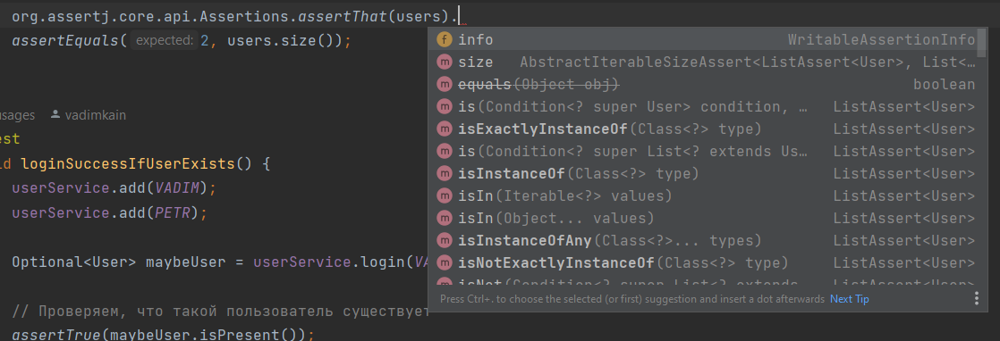
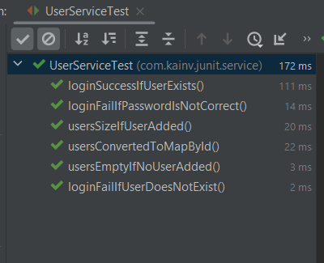

JUnit 5. 7. AssertJ & Hamcrest
==============================

Существуют дополнительные библиотеки которые можем подключать в наш проект и предоставлять более обширный API для наших ассертов. Это **AssertJ** & **Hamcrest**. Разберёмся с каждой из них.

AssertJ
-------

        <dependency>
            <groupId>org.assertj</groupId>
            <artifactId>assertj-core</artifactId>
            <version>3.19.0</version>
            <scope>test</scope>
        </dependency>

Переходим в `UserServiceTest` и к примеру заменим `assertEquals` на метод из assertj. Все AssertJ и Hamcrest имеют следующий функционал: вместо `assertEquals()`, `assertFalse()` и т.д. - они используют `asThat` и смысл в том, что передаём туда значение, которое в дальнейшем будем сравнивать (т.е. передаем сразу актуальное значение, которое будем тестировать). И далее, после того как передали в `.assertThat()`, мы уже можем вызывать невероятно большое кол-во проверок (т.е. сравнение актуального значения с каким-то ожидаемым):

В нашем случае, когда нужно сравнивать размер - обращаемся к методу `.hasSize()`.

        assertThat(users).hasSize(2);

Т.е. проверяем, что размер списка пользователей равен двум. То же самое и с Optional'ами:

**UserServiceTest.java**

        @Test
        void loginSuccessIfUserExists() {
            userService.add(VADIM);
            userService.add(PETR);

            Optional<User> maybeUser = userService.login(VADIM.getUsername(), VADIM.getPassword());

            // Проверяем, что такой пользователь существует
            assertThat(maybeUser).isPresent();
    //        assertTrue(maybeUser.isPresent());
            // Проверяем, действительно ли это тот пользователь (первый параметр - ожидаемый, второй - фактический)
            maybeUser.ifPresent(user -> assertThat(user).isEqualTo(VADIM));
    //        maybeUser.ifPresent(user -> assertEquals(VADIM, user));
        }

Так же в нем удобно тестировать такие коллекции как Map. Например, сделаем метод в `UserService`, который возвращает `Map` пользователей, где ключом является их ID (предварительно немного поменяем метод `add()` в `UserService`:

    package com.kainv.service;

    import com.kainv.dto.User;

    import java.util.\*;

    import static java.util.function.Function.identity;
    import static java.util.stream.Collectors.toMap;

    public class UserService {

        private final List<User> users = new ArrayList<>();

        public List<User> getAll() {
            return users;
        }

        public void add(User... users) {
            this.users.addAll(Arrays.asList(users));
        }

        public Optional<User> login(String username, String password) {
            return users.stream()
                    .filter(user -> user.getUsername().equals(username))
                    .filter(user -> user.getPassword().equals(password))
                    .findFirst();
        }

        public Map<Integer, User> getAllConvertedById() {
            return users.stream().collect(toMap(User::getId, identity()));
        }
    }

    

    package com.kainv.junit.service;

    import com.kainv.dto.User;
    import com.kainv.service.UserService;
    import org.junit.jupiter.api.\*;

    import java.util.List;
    import java.util.Map;
    import java.util.Optional;

    import static org.assertj.core.api.Assertions.assertThat;
    import static org.junit.jupiter.api.Assertions.\*;

    @TestInstance(TestInstance.Lifecycle.PER\_CLASS)
    public class UserServiceTest {

        private UserService userService;
        private static final User VADIM = User.of(1, "Vadim", "123");
        private static final User PETR = User.of(2, "Petr", "123");

        @BeforeAll
        void init() {
            System.out.println("Before all" + this);
        }

        @BeforeEach
        void prepare() {
            System.out.println("Before each: " + this);
            userService = new UserService();
        }

        @Test
        void usersEmptyIfNoUserAdded() {
            System.out.println("Test 1: " + this);
            List<User> users = userService.getAll();
            assertTrue(users.isEmpty(), () -> "User list should be empty");
        }

        @Test
        void usersSizeIfUserAdded() {
            System.out.println("Test 2: " + this);

            userService.add(VADIM);
            userService.add(PETR);

            // Делаем проверку на кол-во пользователей в приложении
            List<User> users = userService.getAll();

            assertThat(users).hasSize(2);
    //        assertEquals(2, users.size());
        }

        @Test
        void loginSuccessIfUserExists() {
            userService.add(VADIM);
            userService.add(PETR);

            Optional<User> maybeUser = userService.login(VADIM.getUsername(), VADIM.getPassword());

            // Проверяем, что такой пользователь существует
            assertThat(maybeUser).isPresent();
    //        assertTrue(maybeUser.isPresent());
            // Проверяем, действительно ли это тот пользователь (первый параметр - ожидаемый, второй - фактический)
            maybeUser.ifPresent(user -> assertThat(user).isEqualTo(VADIM));
    //        maybeUser.ifPresent(user -> assertEquals(VADIM, user));
        }

        @Test
        void loginFailIfPasswordIsNotCorrect() {
            userService.add(VADIM);

            Optional<User> maybeUser = userService.login(VADIM.getUsername(), "incorrect");

            assertTrue(maybeUser.isEmpty());
        }

        @Test
        void usersConvertedToMapById() {
            userService.add(VADIM, PETR);

            Map<Integer, User> users = userService.getAllConvertedById();

            assertAll(
                    () ->
                            // В результирующей коллекции проверяем на содержание ID для Вадима и Петра
                            assertThat(users).containsKeys(VADIM.getId(), PETR.getId()),
                    () ->
                            // Проверяем Map не только на содержание, но и значений
                            assertThat(users).containsValues(VADIM, PETR)
            );

        }

        @Test
        void loginFailIfUserDoesNotExist() {
            userService.add(VADIM);

            Optional<User> maybeUser = userService.login("Dima", VADIM.getPassword());

            assertTrue(maybeUser.isEmpty());
        }

        @AfterEach
        void deleteDataFromDatabase() {
            System.out.println("After each: " + this);
        }

        @AfterAll
        void closeConnectionPool() {
            System.out.println("After all" + this);
        }
    }

Используем `assertAll()` чтобы все ассерт проверились (потому что если один ассерт провалится, то дальше ассерты не будут провериться).

Запускаем тесты и проверяем, что наш функционал работает:

Hamcrest
--------

Эта библиотека была как транзитивная зависимость в JUnit 4. Подключим его и увидим, что подтягивается зависимость. Но в транзитивной зависимости этого недостаточно. Поэтому подключаем дополнительную зависимость:

        <dependency>
            <groupId>junit</groupId>
            <artifactId>junit</artifactId>
            <version>4.13.1</version>
            <scope>test</scope>
        </dependency>
        <dependency>
            <groupId>org.hamcrest</groupId>
            <artifactId>hamcrest-all</artifactId>
            <version>1.3</version>
            <scope>test</scope>
        </dependency>

В этом случае у нас будет гораздо больше всяких matcher'ов которые можем использовать, для того чтобы работать с коллекциями как делаем это в assertj. Только исключим hamcrest, который пришел из junit 4:

        <dependency>
            <groupId>junit</groupId>
            <artifactId>junit</artifactId>
            <version>4.13.1</version>
            <scope>test</scope>
            <exclusions>
                <exclusion>
                    <groupId>org.hamcrest</groupId>
                    <artifactId>hamcrest-core</artifactId>
                </exclusion>
            </exclusions>
        </dependency>
        <dependency>
            <groupId>org.hamcrest</groupId>
            <artifactId>hamcrest-all</artifactId>
            <version>1.3</version>
            <scope>test</scope>
        </dependency>

Возвращаемся в UserServiceTest и смотрим как могли бы переписать `usersConvertedToMapById()` на hamcrest. Он так же как и assertj использует `assertThat` функционал и в нем как и в случае junit передаётся два параметра: актуальное и ожидаемое:

**UserServiceTest.java**

    @Test
    void usersConvertedToMapById() {
        userService.add(VADIM, PETR);

        Map<Integer, User> users = userService.getAllConvertedById();

        MatcherAssert.assertThat(users, IsMapContaining.hasKey(VADIM.getId()));

        assertAll(
                () ->
                        // В результирующей коллекции проверяем на содержание ID для Вадима и Петра
                        assertThat(users).containsKeys(VADIM.getId(), PETR.getId()),
                () ->
                        // Проверяем Map не только на содержание, но и значений
                        assertThat(users).containsValues(VADIM, PETR)
        );
    }
    

    @Test
    void usersEmptyIfNoUserAdded() {
        System.out.println("Test 1: " + this);

        List<User> users = userService.getAll();

        MatcherAssert.assertThat(users, IsEmptyCollection.empty());
        assertTrue(users.isEmpty(), () -> "User list should be empty");
    }

Т.е. суть в том, что у нас есть множество всяких метчеров и они передаются как вторым параметром.