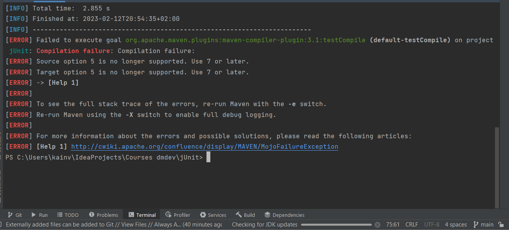
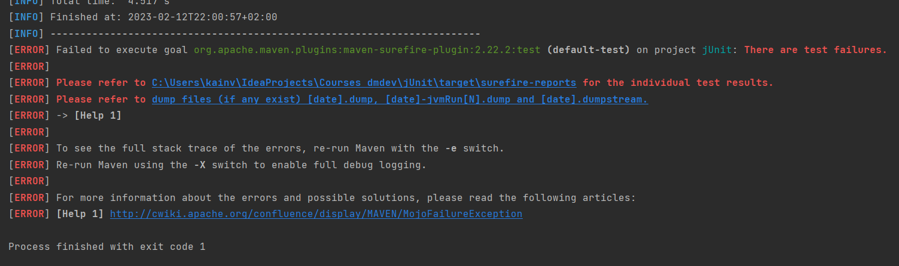

JUnit 5. 2. Установка программного обеспечения
==============================================

В качестве линковщика будем использовать maven. Подключим зависимости для JUnit 5 в pom:

    <dependencies>
        <dependency>
          <groupId>org.junit.jupiter</groupId>
          <artifactId>junit-jupiter-engine</artifactId>
          <version>5.8.0-M1</version>
          <scope>test</scope>
        </dependency>
    </dependencies>

В test/java/com/kainv/junit/service класс UserService:

    package com.kainv.junit.service;
    
    import org.junit.jupiter.api.Test;
    
    import static org.junit.jupiter.api.Assertions.*;
    
    public class UserService {ы
       @Test
       void test() {
           assertTrue(false);
       }
    }

И выполним `mvn test`. И увидим проблемы:

Во первых надо переопределить maven-compiler-plugin потому что JUnit использует версию 8 или выше. Во вторых надо будет переопределить surefire-plugin до новой версии.

    <build>
        <plugins>
            <plugin>
                <groupId>org.apache.maven.plugins</groupId>
                <artifactId>maven-compiler-plugin</artifactId>
                <version>3.8.1</version>
                <configuration>
                    <source>15</source>
                    <target>15</target>
                </configuration>
            </plugin>
            <plugin>
                <groupId>org.apache.maven.plugins</groupId>
                <artifactId>maven-surefire-plugin</artifactId>
                <version>2.22.2</version>
            </plugin>
        </plugins>
    </build>

Обновляем и выполняем `mvn test`. Проект сбилдился, но тесты не выполнились потому что наш тест-класс не с постфиксом `Test` (это дефолтное определение, наши тесты должны иметь определённый префиксы либо суффиксы). Поправим `UserService` на `UserServiceTest` и запустим:

Видим, что тест провалился потому что у нас нет такого класса в main.

Если хотим из командной строки запустить, то необходим wrapper. В командной строке вводим `mvn -N io.takari:maven:0.7.7:wrapper -Dmaven=3.6.3`. Получаем директорию .mvn где находится наш maven-wrapper. Более того, можем изменять наши пути к нужным нам установочникам в _.properties_. Теперь у нас есть файл _mvnw_ & _mvnw.cmd_ и использовать команду не `mvn`, а `./mvnw ...`.

=======

    package com.kainv.junit.service;
    
    import org.junit.jupiter.api.Test;
    
    import static org.junit.jupiter.api.Assertions.*;
    
    public class UserService {
        @Test
        void test() {
            assertTrue(false);
        }
    }

И выполним `mvn test`. И увидим проблемы:

Во первых надо переопределить maven-compiler-plugin потому что JUnit использует версию 8 или выше. Во вторых надо будет переопределить surefire-plugin до новой версии.

    <build>
        <plugins>
            <plugin>
                <groupId>org.apache.maven.plugins</groupId>
                <artifactId>maven-compiler-plugin</artifactId>
                <version>3.8.1</version>
                <configuration>
                    <source>15</source>
                    <target>15</target>
                </configuration>
            </plugin>       
            <plugin>
                <groupId>org.apache.maven.plugins</groupId>
                <artifactId>maven-surefire-plugin</artifactId>
                <version>2.22.2</version>
            </plugin>
        </plugins>
    </build>

Обновляем и выполняем `mvn test`. Проект сбилдился, но тесты не выполнились потому что наш тест-класс не с постфиксом `Test` (это дефолтное определение, наши тесты должны иметь определённый префиксы либо суффиксы). Поправим `UserService` на `UserServiceTest` и запустим:

Видим, что тест провалился потому что у нас нет такого класса в main.

Если хотим из командной строки запустить, то необходим wrapper. В командной строке вводим `mvn -N io.takari:maven:0.7.7:wrapper -Dmaven=3.6.3`. Получаем директорию .mvn где находится наш maven-wrapper. Более того, можем изменять наши пути к нужным нам установочникам в _.properties_. Теперь у нас есть файл _mvnw_ & _mvnw.cmd_ и использовать команду не `mvn`, а `./mvnw ...`.

Теперь проект можно запускать как из IDE, так и из командной строки.