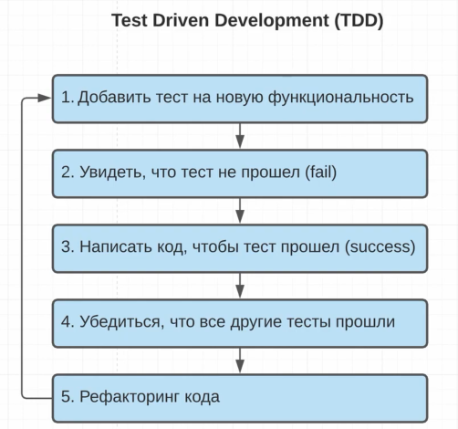
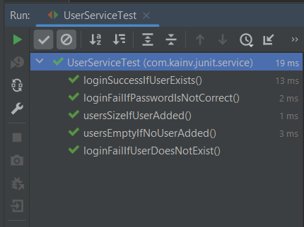

JUnit 5. 6. Test Driven Development. TDD
========================================

Суть её в том, что в процессе разработки ПО мы сначала пишем тесты, а за тем уже основной функционал, который покрываем этими тестами. Этот процесс можно разбить на шаги:

1.  Добавить тест на новую функциональность.
2.  Запустить тест. Естественно, вначале не получится запустить потому что будет ошибки компиляции. В итоге увидим, что тест не прошёл.
3.  Пишем код, чтобы тест прошёл
4.  Убеждаемся, что все другие тесты прошли. Это важный шаг. Здесь также ключевую роль играет **регрессия**, т.е. проверка того, что мы не нарушили существующий код. Это потому что пишем не только новый функционал, но и также изменяем его. Следственно, чтобы не нарушить ничего нас и спасают наши тесты, которые писали до этого. Поэтому, в четвертом шаге убеждаемся, что они (тесты) так же прошли.
5.  После чего выполняем рефакторинг кода. Это тоже один из важных шагов потому что есть хороший принцип, что должны после себя оставить код лучше, чем когда в первый раз видели. Так же сюда можно отнести принцип разбитого окна (книга программист-прагматик).

Если рассматривать упрощённую систему TDD, то получаются три главных шага:

1.  **RED**
2.  **GREEN**
3.  **REFACTOR**

На примере UserService реализуем TDD
------------------------------------

Создадим функцию авторизации пользователя в системе. Первым тестом будет тест на успешную авторизацию, если пользователь существует. Помимо этого в pom.xml подключим зависимость к lombok.

    package com.kainv.junit.service;

    import com.kainv.dto.User;
    import com.kainv.service.UserService;
    import org.junit.jupiter.api.\*;

    import java.util.List;
    import java.util.Optional;

    import static org.junit.jupiter.api.Assertions.\*;

    @TestInstance(TestInstance.Lifecycle.PER\_CLASS)
    public class UserServiceTest {

        private UserService userService;
        private static final User VADIM = User.of(1, "Vadim", "123");
        private static final User PETR = User.of(2, "Petr", "123");

        @BeforeAll
        void init() {
            System.out.println("Before all" + this);
        }

        @BeforeEach
        void prepare() {
            System.out.println("Before each: " + this);
            userService = new UserService();
        }

        @Test
        void usersEmptyIfNoUserAdded() {
            System.out.println("Test 1: " + this);
            List<User> users = userService.getAll();
            assertTrue(users.isEmpty(), () -> "User list should be empty");
        }

        @Test
        void usersSizeIfUserAdded() {
            System.out.println("Test 2: " + this);
            userService.add(VADIM);
            userService.add(PETR);

            // Делаем проверку на кол-во пользователей в приложении
            List<User> users = userService.getAll();

            assertEquals(2, users.size());
        }

        @Test
        void loginSuccessIfUserExists() {
            userService.add(VADIM);
            userService.add(PETR);
            Optional<User> maybeUser = userService.login(VADIM.getUsername(), VADIM.getPassword());

            // Проверяем, что такой пользователь существует
            assertTrue(maybeUser.isPresent());
            // Проверяем, действительно ли это тот пользователь (первый параметр - ожидаемый, второй - фактический)
            maybeUser.ifPresent(user -> assertEquals(VADIM, user));
        }

        @AfterEach
        void deleteDataFromDatabase() {
            System.out.println("After each: " + this);
        }

        @AfterAll
        void closeConnectionPool() {
            System.out.println("After all" + this);
        }
    }

Теперь реализовываем функционал для `userService.login()`:

    package com.kainv.service;

    import com.kainv.dto.User;

    import java.util.ArrayList;
    import java.util.List;
    import java.util.Optional;

    public class UserService {

        private final List<User> users = new ArrayList<>();

        public List<User> getAll() {
            return users;
        }

        public boolean add(User user) {
            return users.add(user);
        }

        public Optional<User> login(String username, String password) {
            return users.stream()
                    .filter(user -> user.getUsername().equals(username))
                    .filter(user -> user.getPassword().equals(password))
                    .findFirst();
        }
    }

Запускаем тесты и проверяем:

Видим, что тест прошел успешно. Мы не изменяли другие методы и следовательно, маловероятно, что мы могли что-то повредить. Тем не менее шанс есть. Продолжаем писать функционал: на случай, если пароль неправильный.

И сделаем проверку, если пользователя не существует.

    package com.kainv.junit.service;

    import com.kainv.dto.User;
    import com.kainv.service.UserService;
    import org.junit.jupiter.api.\*;

    import java.util.List;
    import java.util.Optional;

    import static org.junit.jupiter.api.Assertions.\*;

    @TestInstance(TestInstance.Lifecycle.PER\_CLASS)
    public class UserServiceTest {

        private UserService userService;
        private static final User VADIM = User.of(1, "Vadim", "123");
        private static final User PETR = User.of(2, "Petr", "123");

        @BeforeAll
        void init() {
            System.out.println("Before all" + this);
        }

        @BeforeEach
        void prepare() {
            System.out.println("Before each: " + this);
            userService = new UserService();
        }

        @Test
        void usersEmptyIfNoUserAdded() {
            System.out.println("Test 1: " + this);
            List<User> users = userService.getAll();
            assertTrue(users.isEmpty(), () -> "User list should be empty");
        }

        @Test
        void usersSizeIfUserAdded() {
            System.out.println("Test 2: " + this);

            userService.add(VADIM);
            userService.add(PETR);

            // Делаем проверку на кол-во пользователей в приложении
            List<User> users = userService.getAll();

            assertEquals(2, users.size());
        }

        @Test
        void loginSuccessIfUserExists() {
            userService.add(VADIM);
            userService.add(PETR);

            Optional<User> maybeUser = userService.login(VADIM.getUsername(), VADIM.getPassword());

            // Проверяем, что такой пользователь существует
            assertTrue(maybeUser.isPresent());
            // Проверяем, действительно ли это тот пользователь (первый параметр - ожидаемый, второй - фактический)
            maybeUser.ifPresent(user -> assertEquals(VADIM, user));
        }

        @Test
        void loginFailIfPasswordIsNotCorrect() {
            userService.add(VADIM);

            Optional<User> maybeUser = userService.login(VADIM.getUsername(), "incorrect");

            assertTrue(maybeUser.isEmpty());
        }

        @Test
        void loginFailIfUserDoesNotExist() {
            userService.add(VADIM);

            Optional<User> maybeUser = userService.login("Dima", VADIM.getPassword());

            assertTrue(maybeUser.isEmpty());
        }

        @AfterEach
        void deleteDataFromDatabase() {
            System.out.println("After each: " + this);
        }

        @AfterAll
        void closeConnectionPool() {
            System.out.println("After all" + this);
        }
    }

В итоге получается, что мы сначала подготавливаем какие-то данные, вторым шагом делаем запрос на ту функцию, которую проверяем и третий шаг - добавляем `assert`'ы на то, что сделали.

Проверим, что все тесты проходят:

