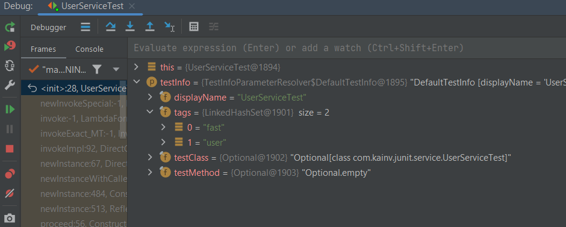
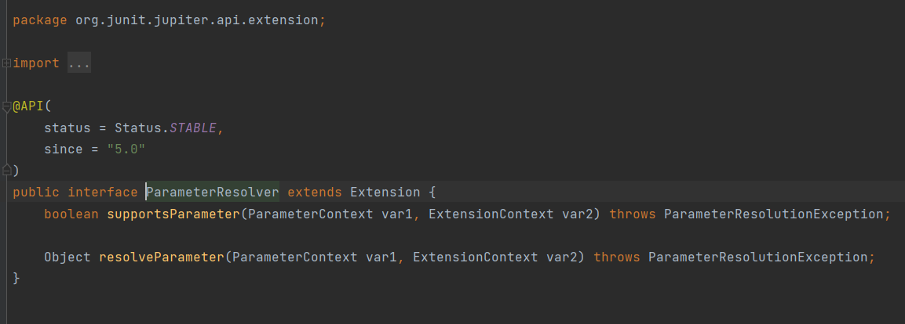
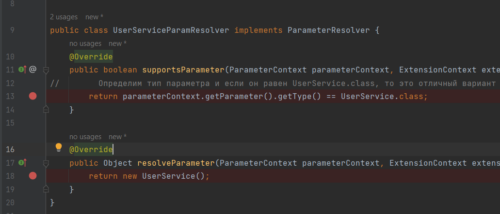
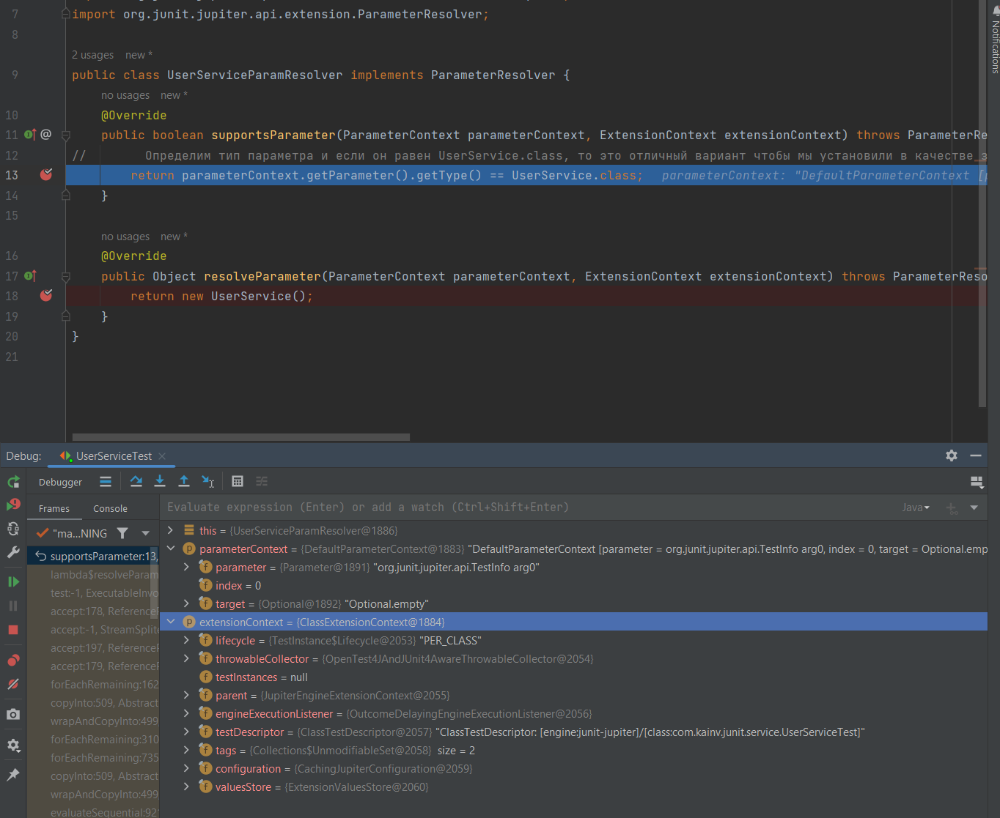
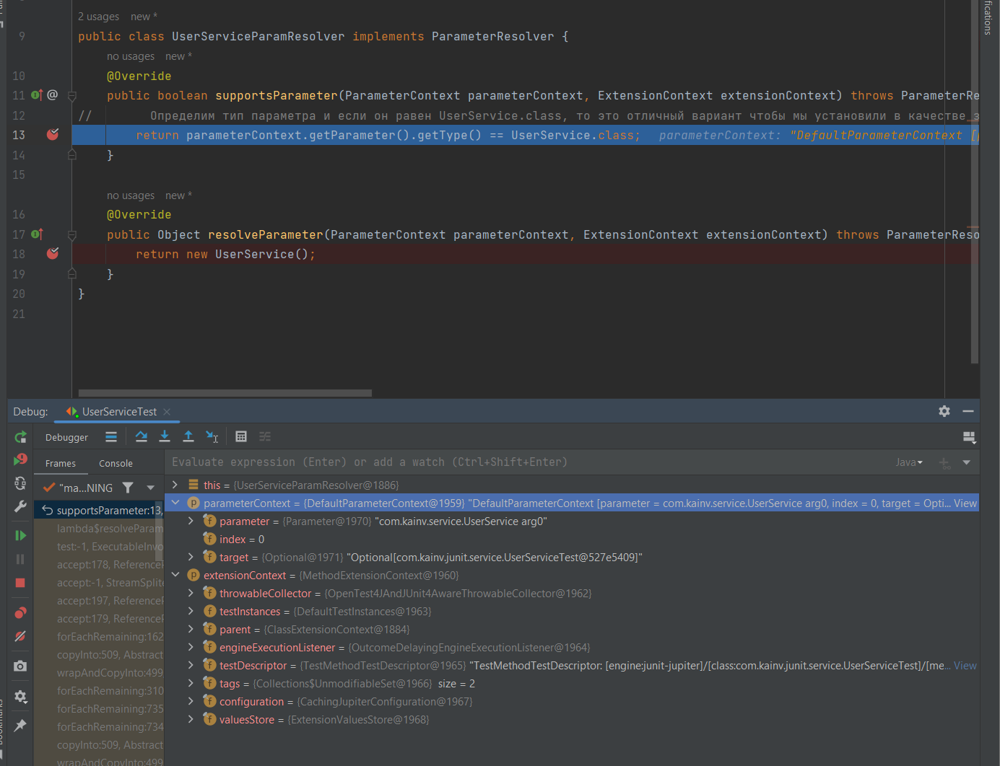
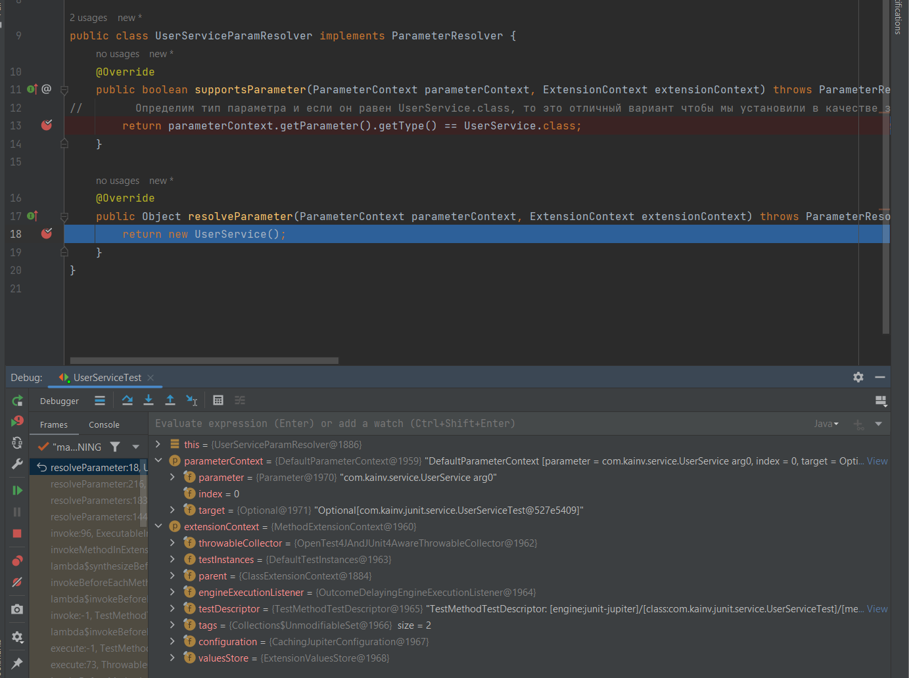

JUnit 5. 11. Dependency Injection. DI
=====================================

Начиная c JUnit 5 нам добавили возможность использовать такой паттерн _Dependency Injection_ который говорит нам о том, что есть какой-то объект либо совокупность этих объектов, который предоставляет нам зависимости для других объектов.

Например, есть `UserServiceTest`, который зависит от `UserService`. Следовательно, `UserService` это зависимость у нашего `UserServiceTest`. Поэтому DI говорит нам о том, что у нас есть какой-то сторонний объект, который предоставит нам этот `UserService` если попросим его для нашей `UserServiceTest`.

Такой подход есть во многих фреймворках. В реальной практике когда используем JUnit фреймворк вместе со спрингом, то используется именно DI спринга. Но если нет спринга и используем JUnit 5, то можем воспользоваться DI механизмом для реализации своих нужд.

Например, можем создать конструктор `UserServiceTest` и в нём попросить какую-ту зависимость. Например `TestInfo`, т.е. я хочу чтобы какой-то объект который занимается предоставлением зависимостей мне дал объект с типом `TestInfo`. Более того, мы используем конструктор в своём `UserServiceTest`, в предыдущих версиях JUnit нельзя было делать такие конструкторы с какими-то параметрами потому что было обязательное требование - это то, что у тестового класса должен быть конструктор без параметров.

**UserServiceTest.java**

    UserServiceTest(TestInfo testInfo) {
        System.out.println();
    }

Теперь, если запустим `UserServiceTest` в дебаге внутри конструктора, то увидим, что у нас в `testInfo` приходит какой-то объект, который содержит информацию:

`testMethod` говорит о том, что мы можем использовать такой механизм DI не только в конструкторах, но и в тестовых методах. По сути, когда вспоминаем тему про жизненный цикл тестов, то можем использовать DI для всех наших основных аннотаций (`@BeforeAll` - `@AfterAll`).

**Как работает такой механизм?** Есть специальный класс, который называется `ParameterResolver` который наследуется от `Extension`. В `ParameterResolver` есть два метода:

`supportsParameter` вызывается вначале когда DI фреймворк определяет, подходит ли этот параметр нашего метода под наш параметр resolver который предоставит в последующем объект этого типа. Если подходит, то вызывается `resolveParameter` и мы должны вернуть этот объект. Если нет, то resolver параметр не возвращается.

Уже есть готовые параметры resolver'ы. Как раз тот `TestInfo` который видели это `TestInfoParameterResolver`. Самое интересное это то, что мы можем реализовывать свои ParameterResolver'ы.

Например, в `UserServiceTest` хотим добавить параметр-resolver который предоставит `UserService`. Для этого создадим пакет **paramresolver** и создадим класс `UserServiceParamResolver` и всё что необходимо сделать - это реализовать интерфейс `ParamResolver`:

    package com.kainv.junit.paramresolver;

    import org.junit.jupiter.api.extension.ExtensionContext;
    import org.junit.jupiter.api.extension.ParameterContext;
    import org.junit.jupiter.api.extension.ParameterResolutionException;
    import org.junit.jupiter.api.extension.ParameterResolver;

    public class UserServiceParamResolver implements ParameterResolver {
        @Override
        public boolean supportsParameter(ParameterContext parameterContext, ExtensionContext extensionContext) throws ParameterResolutionException {
            return false;
        }

        @Override
        public Object resolveParameter(ParameterContext parameterContext, ExtensionContext extensionContext) throws ParameterResolutionException {
            return null;
        }
    }

Теперь должны эти два метода реализовать. `ParameterContext` это объект говорящий нам всю информацию о параметре, который мы в последующем либо за-inject'им (будем зависимы) вернув true либо нет вернув false. У него есть куча методов, но главный из них это `getParameter()`.

    package com.kainv.junit.paramresolver;

    import com.kainv.service.UserService;
    import org.junit.jupiter.api.extension.ExtensionContext;
    import org.junit.jupiter.api.extension.ParameterContext;
    import org.junit.jupiter.api.extension.ParameterResolutionException;
    import org.junit.jupiter.api.extension.ParameterResolver;

    public class UserServiceParamResolver implements ParameterResolver {
        @Override
        public boolean supportsParameter(ParameterContext parameterContext, ExtensionContext extensionContext) throws ParameterResolutionException {
    //        Определим тип параметра и если он равен UserService.class, то это отличный вариант чтобы мы установили в качестве зависимости свой
            return parameterContext.getParameter().getType() == UserService.class;
        }

        @Override
        public Object resolveParameter(ParameterContext parameterContext, ExtensionContext extensionContext) throws ParameterResolutionException {
            return new UserService();
        }
    }

Здесь мы просто создаём через `new`, но в реальных проектах мы можем иметь более сложный механизм соединения этих зависимостей.

Теперь в `UserServiceTest` и попросим `UserService` для нашего `prepare()` метода:

**UserServiceTest.java**

    @BeforeEach
    void prepare(UserService userService) {
        System.out.println("Before each: " + this);
        this.userService = userService;
    }

И теперь вместо того, чтобы создавать его самим - мы просим его у нашего фреймворка. Для того чтобы использовать этот `UserServiceParamResolver` мы должны помочь DI механизму. Для этого используется наша Extension модель `@ExtendWith()` в которую передаём все классы-extension. Т.е. мы уходим от всех правил JUnit 4 и просто добавляем какой-то функционал к нашему тесту. Т.е. реализуем его.

    @Tag("fast")
    @Tag("user")
    @TestInstance(TestInstance.Lifecycle.PER\_CLASS)
    @TestMethodOrder(MethodOrderer.DisplayName.class)
    @ExtendWith({
            UserServiceParamResolver.class
    })
    public class UserServiceTest {

Это уже как бы минус для DI механизма, что должны указывать такие ресловеры. Спринг в таком плане поможет решить эту проблему. Установим брекпоинты в этих местах:

И запустим дебаг:

Мы пришли в `UserServiceParamResolver`. Во-первых он создаётся один раз, т.е. даже если мы несколько раз пытаемся предоставить `UserService` объект в наших методах, то `UserServiceParamResolver` у нас один как синглтон. Это очень важно потому что мы можем к примеру реализовать какой-то функционал для кэширования объектов. Т.е. если не хотим каждый раз возвращать новый объект `UserService`, то можем создать поле в `UserServiceParamResolver` и только один раз его проинициализировать.

Мы получили параметр `parameterContent` в котором видим, что сейчас требуется TestInfo. Т.к. это ParameterResolver для UserService, то он вернёт false и `resolveParameter` не отработает.

Продолжим выполнение программы и получим:

Теперь просим получить `UserService`. `parameterContext` вернёт true и вызовется `resolveParameter`:

Мы видим все тот же `parameterContext` и `extensionContext`. В `extensionContext` хранится информация о нашем классе.

Что ещё есть в этом ParameterResolver'е
---------------------------------------

Мы можем закешировать `UserService`, но есть готовый инструмент для кеширования: `extensionContext.getStore(Namespace namespace)`. Namespace - это по сути ключ для нашего getStore. Неймспейсы можно создавать свои или использовать один глобальный:

**UserServiceParamResolver.java**

        @Override
        public Object resolveParameter(ParameterContext parameterContext, ExtensionContext extensionContext) throws ParameterResolutionException {
    //        Для методов которые требуют UserService мы возвращаем всегда один и тот же store:
            ExtensionContext.Store store = extensionContext.getStore(ExtensionContext.Namespace.create(UserService.class));
    //        Получаем по ключу значение
            return store.getOrComputeIfAbsent(UserService.class, it -> new UserService());
        }

`.create()` принимает массив, поэтому можем создать какой угодно сложный ключ, чтобы возвращать один объект или разные. В данном случае будет возвращаться один и тот же объект потому что мы получаем Namespace один и тот же (`UserService`) но мы к примеру можем опираться не на `UserService.class`, а на название метода. Тогда для каждого метода создавался бы заново наш `UserService`:

**UserServiceParamResolver.java**

        @Override
        public Object resolveParameter(ParameterContext parameterContext, ExtensionContext extensionContext) throws ParameterResolutionException {
    //        Для методов которые требуют UserService мы возвращаем всегда один и тот же store:
            ExtensionContext.Store store = extensionContext.getStore(Namespace.create(extensionContext.getTestMethod()));
    //        Получаем по ключу значение
            return store.getOrComputeIfAbsent(UserService.class, it -> new UserService());
        }

Лучше метод использовать в качестве ключа в том же объекте store, чтобы не создавать новый store.

Таких `ParameterResolver`'ов можем создавать сколько угодно потому что `@ExtendWith` принимает массив таких екстеншинов. На практике они не так часто используются потому что в основном предпочитают использовать DI от Spring.