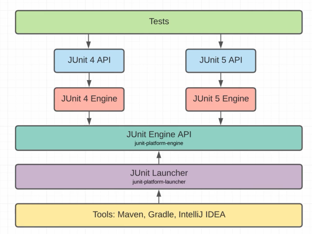
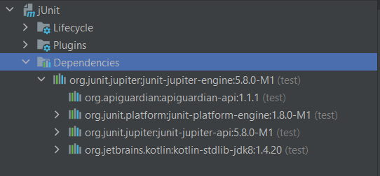
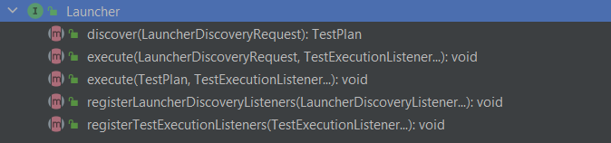
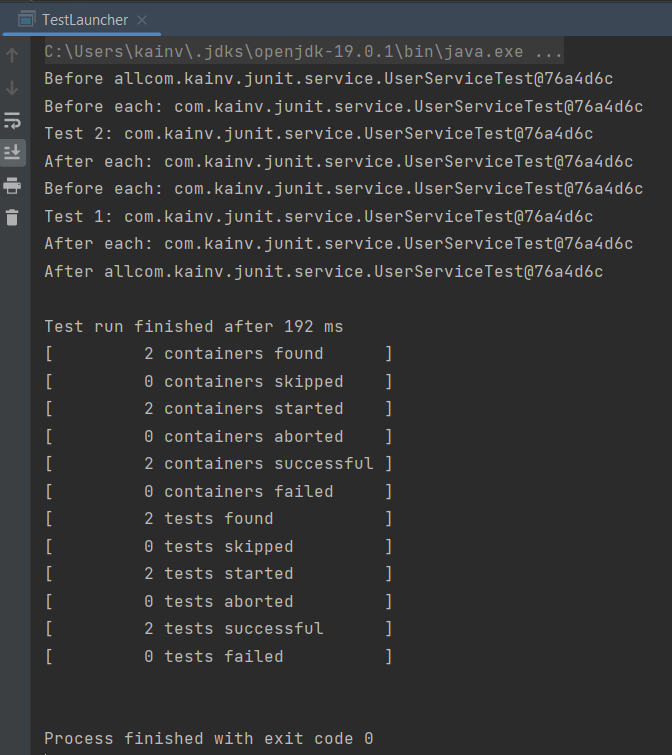

JUnit 5. 5. Запуск тестов. Launcher API
=======================================

Разберёмся как удаётся запускать тесты
--------------------------------------

В Java есть один единственный метод main, который можем запускать в языке программирования Java. Отсюда можем видеть то, как устроен JUnit 5:

Когда пишем наши тесты - мы используем **_JUnit 5 API_**, который в свою очередь разбит на подпроекты.

В свою очередь для выполнения тестов нам нужен **_JUnit Engine_**, он транзитивной зависимостью предоставил JUnit 5 API.

В свою очередь чтобы мы могли писать на разных версиях JUnit у нас есть общий API для всех test engine'ов, это **_JUnit Engine API_**. Он также является транзитивной зависимостью когда подключаем _JUnit Engine_. Эта платформа называется _junit-platform-engine_.

Если посмотрим на подключенные зависимости, то увидим, что как только подключили _junit-jupiter-engine_, то подключились _junit-jupiter-api_, который используем для написания тестов и откуда у нас есть наши `Assertions`, аннотации т.д.. И в то же самое время видим _junit-platform-engine_, который представляет API (по сути набор классов и интерфейсов), которые уже реализуются нашим _junit-jupiter-engine_ для того чтобы писать на JUnit 5. Если хотим писать на JUnit 4, то там уже будет свой engine либо можем написать даже кастомный engine и все это так же будет работать если будем использовать _junit-platform-engine_.

В свою очередь, для запуска тестов мы используем инструменты (**_Tools_**). Все они используют **_JUnit Launcher_**. Мы можем подключить эту зависимость и с помощью её вызвать соответствующие _junit-platform-engine_ и проверить наши тесты.

Подключим зависимость JUnit Launcher вручную
--------------------------------------------

        <dependencies>
            <dependency>
                <groupId>org.junit.jupiter</groupId>
                <artifactId>junit-jupiter-engine</artifactId>
                <version>5.8.0-M1</version>
                <scope>test</scope>
            </dependency>
            <dependency>
                <groupId>org.junit.platform</groupId>
                <artifactId>junit-platform-launcher</artifactId>
                <version>1.8.0-M1</version>
                <scope>test</scope>
            </dependency>
        </dependencies>

И напишем свой класс с методом `main`, который запускает наши тесты. В методе `main` нужно создать `Launcher`, его объект.

    package com.kainv;

    import org.junit.platform.launcher.Launcher;
    import org.junit.platform.launcher.core.LauncherFactory;

    public class TestLauncher {
        public static void main(String\[\] args) {
            Launcher launcher = LauncherFactory.create();
        }
    }

Дефолтный интерфейс `Launcher` содержит набор методов:

*   **discover** - нужен, для того чтобы найти те методы, которые нужно запустить (т.е. наши тестовые методы).
*   **execute** - нужен, для того чтобы запустить найденные тесты.
*   **registerLauncherDiscoveryListeners** - отслеживает события когда находим какие-то тесты.
*   **registerTestExecutionListeners** - отслеживают выполнения каждого из этих тестов.

Также есть и `DefaultLauncher`, который возвращается когда ничего не передаём в метод `create()`.

Далее, можем вызвать `execute()` и выполнить тесты. В нём есть два перегруженных метода: `TestPlan` (он и является основным) и `LauncherDiscoveryRequest`, который в последующем оборачивается в `TestPlan`. В нашем случае создадим request при помощи объекта `LauncherDiscoveryRequest` (можно и через `launcher.registerLauncherDiscoveryListeners()`):

    package com.kainv.junit;

    import org.junit.platform.engine.discovery.DiscoverySelectors;
    import org.junit.platform.launcher.Launcher;
    import org.junit.platform.launcher.LauncherDiscoveryRequest;
    import org.junit.platform.launcher.core.LauncherDiscoveryRequestBuilder;
    import org.junit.platform.launcher.core.LauncherFactory;

    public class TestLauncher {
        public static void main(String\[\] args) {
            Launcher launcher = LauncherFactory.create();

    //        launcher.registerLauncherDiscoveryListeners();

            LauncherDiscoveryRequest request = LauncherDiscoveryRequestBuilder
                    .request()
    //                Указываем, где наш request будет искать наши тесты
    //                .selectors(DiscoverySelectors.selectClass(UserServiceTest.class))
                    .selectors(DiscoverySelectors.selectPackage("com.kainv.junit.service"))
                    .build();
        }
    }

Теперь, в `launcher.execute()` первым параметром передаём `request` и вторым параметром можем передать `TestExecutionListener` (также могли бы передать в `launcher.registerTestExecutionListeners();`). Эти листенеры как раз нужны, для того чтобы увидеть результат выполнения тестов потому что метод `execute()` возвращают `void`.

    package com.kainv.junit;

    import org.junit.platform.engine.discovery.DiscoverySelectors;
    import org.junit.platform.launcher.Launcher;
    import org.junit.platform.launcher.LauncherDiscoveryRequest;
    import org.junit.platform.launcher.core.LauncherDiscoveryRequestBuilder;
    import org.junit.platform.launcher.core.LauncherFactory;
    import org.junit.platform.launcher.listeners.SummaryGeneratingListener;

    public class TestLauncher {
        public static void main(String\[\] args) {
            Launcher launcher = LauncherFactory.create();

    //        launcher.registerLauncherDiscoveryListeners();
    //        launcher.registerTestExecutionListeners();

            SummaryGeneratingListener summaryGeneratingListener = new SummaryGeneratingListener();

            LauncherDiscoveryRequest request = LauncherDiscoveryRequestBuilder
                    .request()
    //                Указываем, где наш request будет искать наши тесты
    //                .selectors(DiscoverySelectors.selectClass(UserServiceTest.class))
                    .selectors(DiscoverySelectors.selectPackage("com.kainv.junit.service"))
                    .build();

            launcher.execute(request, summaryGeneratingListener);
        }
    }

Следовательно, для того чтобы посмотреть нашу статистику, то у `summaryGeneratingListener.getSummary()` после выполнения есть куча методов. Можем воспользоваться `.printTo()`, который на вход принимает `PrintWriter` (а значит надо использовать try-with-resources):

    package com.kainv.junit;

    import org.junit.platform.engine.discovery.DiscoverySelectors;
    import org.junit.platform.launcher.Launcher;
    import org.junit.platform.launcher.LauncherDiscoveryRequest;
    import org.junit.platform.launcher.core.LauncherDiscoveryRequestBuilder;
    import org.junit.platform.launcher.core.LauncherFactory;
    import org.junit.platform.launcher.listeners.SummaryGeneratingListener;

    import java.io.PrintWriter;

    public class TestLauncher {
        public static void main(String\[\] args) {
            Launcher launcher = LauncherFactory.create();

    //        launcher.registerLauncherDiscoveryListeners();
    //        launcher.registerTestExecutionListeners();

            SummaryGeneratingListener summaryGeneratingListener = new SummaryGeneratingListener();

            LauncherDiscoveryRequest request = LauncherDiscoveryRequestBuilder
                    .request()
    //                Указываем, где наш request будет искать наши тесты
    //                .selectors(DiscoverySelectors.selectClass(UserServiceTest.class))
                    .selectors(DiscoverySelectors.selectPackage("com.kainv.junit.service"))
                    .build();

            launcher.execute(request, summaryGeneratingListener);

    //          Выводим результат тестирования
            try (PrintWriter writer = new PrintWriter(System.out)) {
                summaryGeneratingListener.getSummary().printTo(writer);
            }
        }
    }

Запустим класс и посмотрим что выведет:

Он обнаружил два теста, два теста запустились и эти два теста завершились успешно.

Зайдём в метод `execute()`, который выполняет наши тесты. Зайдём в `DefaultLauncher`. Когда получаем `DiscoveryRequest` - мы на основании его билдим тестовый план и все равно в итоге получаем реализацию класса `class InternalTestPlan extends TestPlan` (это общий объект, чтобы запускать наши тесты, он содержит все по состоянию наших тестов). (10:00) И далее, в `DefaultLauncher` когда выполняем `execute()` (переходим по нему) и видим, что из нашего `InternalTestPlan` берутся все листенеры, которые билдятся в методе `buildListenerRegistryForExecution` и если мы не передали в метод листенеры, то возвращаются те, которые были зарегистрированы во время создания лаунчера. В противном случае берём общую коллекцию с нашими листенерами которые зарегистрировали и + те, что передали в метод `execute`. Далее создаётся общий комбинированный листенер, в котором запускается метод `testPlanExecutionStarted` и `testPlanExecutionFinished` и во время него так же вызываются события нашего листенера. Т.е. только через листенер мы можем посмотреть что произошло во время выполнения тестов.

Так же когда выполняем метод `create()`, то передаём дефолтный `LauncherConfig` для создания его и создаётся `createDefaultLauncher()` в котором собираются все тестовые engine'ы. В нам случае используются `TestEngine`. Это как раз относится к JUnit Engine API.