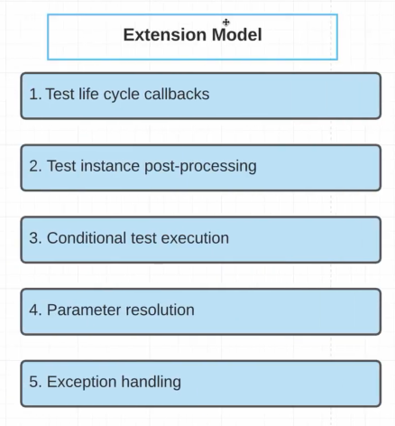
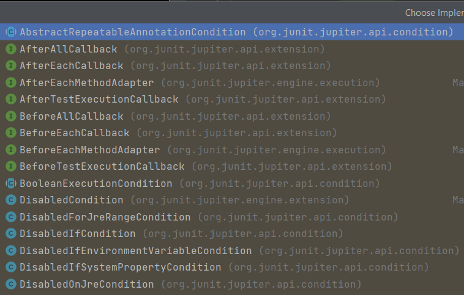

JUnit 5. 14. Extension Model. Теория
====================================

Что такое extension model в JUnit 5?
------------------------------------

Extension Model в JUnit 5 - это новая функциональность, которая позволяет расширять функциональность фреймворка JUnit 5. Он предоставляет возможность программистам настраивать поведение JUnit 5 во время выполнения тестов, добавляя новые функциональные возможности, такие как логирование, запуск тестов в параллельном режиме, подключение к базам данных и многое другое.

Расширения могут быть написаны как отдельные классы, реализующие интерфейс Extension, так и использовать предоставляемые фреймворком аннотации, такие как `@BeforeEachCallback` или `@AfterAllCallback`. Расширения могут быть добавлены как к классам тестов, так и к тестовым методам, что дает большую гибкость в управлении поведением тестов.

Extension Model позволяет программистам создавать свои собственные расширения или использовать существующие, доступные из различных источников, таких как библиотеки, плагины или фреймворки. Расширения могут быть объявлены в файле META-INF/services/org.junit.jupiter.api.extension.Extension, который будет автоматически обнаружен и загружен при запуске тестов.

Т.е., Extension Model это некий прокси-паттерн?
-----------------------------------------------

Extension Model в JUnit 5 можно рассматривать как реализацию паттерна расширяемости. Это позволяет настраивать и расширять поведение фреймворка JUnit 5, не изменяя его исходный код.

Внутри Extension Model используется механизм вызова методов обратного вызова (callback), который позволяет расширениям реагировать на определенные события, связанные с выполнением тестов. Например, при запуске теста может быть вызван метод обратного вызова "beforeEach", который позволяет расширению выполнить какую-то дополнительную подготовку перед запуском теста.

Таким образом, можно сказать, что Extension Model - это не конкретный паттерн, а набор функциональности, реализующий паттерны расширяемости и обратных вызовов для настройки поведения фреймворка JUnit 5.

Расскажи про паттерн расширяемости
----------------------------------

Паттерн расширяемости (Extensibility Pattern) - это паттерн проектирования, который позволяет расширять функциональность программного продукта без необходимости изменения его исходного кода.

Паттерн расширяемости широко используется в различных программных продуктах и фреймворках. Он позволяет добавлять новые возможности и функции в систему без необходимости изменения ее основной функциональности. Это делает систему более гибкой и удобной для использования, так как пользователи могут настраивать ее под свои потребности и задачи.

Для реализации паттерна расширяемости используются различные механизмы, такие как плагины, расширения, модули и т.д. Основная идея заключается в том, чтобы разбить систему на модули, которые могут быть расширены или заменены при необходимости.

Примером фреймворка, который использует паттерн расширяемости, является Spring Framework. В Spring существует множество расширений (Extension Points), которые позволяют настраивать и расширять поведение фреймворка. Это позволяет разработчикам создавать более гибкие и масштабируемые приложения, которые могут легко адаптироваться к изменяющимся требованиям бизнеса.

В JUnit 5 паттерн расширяемости реализуется через Extension Model, который позволяет расширять функциональность фреймворка и настраивать поведение тестов во время их выполнения. Расширения могут быть написаны для решения различных задач, таких как логирование, запуск тестов в параллельном режиме, подключение к базам данных и т.д.

Аннотация @ExtendWith({})
-------------------------

Мы её уже использовали ранее на DI механизме, когда создавали свои параметры-resolver'ы и сейчас более подробно поговорим про это.

Extension Model представляет собой пять основных типов:

1.  **Test life cycle callbacks** - т.е. мы можем внедриться в любую часть жизненного цикла наших тестов и добавить какой-то функционал в любой из частей нашего жизненного цикла. Поэтому, мы благодаря специальным callback'ам (_это всего лишь интерфейсы_) мы можем внедриться в любой из шагов жизненного цикла теста.
2.  **Test instance post-processing \*** - такая возможность позволяет нам что-то подкрутить после создания объекта нашего тестового класса. Т.е. мы знаем, что по умолчанию каждый раз создаётся новый объект класса `UserServiceTest` и вызывается собственно наш тест. Так вот именно этот callback позволяет нам добавить какую-ту свою функциональность сразу же после создания этого объекта. Как раз таки спринг использует такую возможность, для того чтобы внедрить свои зависимости в этот объект.
3.  **Conditional test execution** - такая возможность extension model'и позволяет нам какие-то условия на выполнения либо невыполнения тестов. Например, можем какие-то тесты отключить если environment variables будет qa или что-то вроде этого. Т.е. у нас есть доступ практически ко всему и мы можем на основании этих данных принимать решение о выполнении или невыполнении каких-то тестов.
4.  **Parameter resolution** - проходили на теме по DI. Т.е. можем без проблем создать свои параметры-resolution'ы, для того чтобы внедрять свои зависимости в любой из методов жизненного цикла наших тестов.
5.  **Exception handling** - т.е. можем отлавливать исключения, которые пробрасываются в наших тестах и так же с ними что-то подкрутить, что-то сделать.

Вспомним как делать parameter resolution
----------------------------------------

Т.е. мы добавляем какой-то функционал к нашему тесту через `@ExtendWith`. Т.е. добавляем какое-то поведение и в этот раз уже можем передавать массив таких `Extension'ов`. Главная задача - это всего лишь реализовать интерфейс `Extension`.

### Что это за интерфейс

Это всего-лишь интерфейс маркер по типу serializable, который говорит лишь о том, что мы можем использовать объекты типа `Extension` как модель для расширения наших классов.

Поэтому создали `UserServiceParamResolver`, который имплементил `ParameterResolver`, который в свою очередь является нашим `Extension`'ом. Нам надо было реализовать всего лишь два простых метода и которые автоматически вызывались у нас во время выполнения наших тестов.

У нас появляется очень интересный момент - это `ExtensionContext`. Это по сути полная информация по нашему `ExtensionContext` выполнению. И здесь мы можем получить довольно много информации.

Возвращаясь к parameter resolution который реализовали
------------------------------------------------------

Мы так же использовали наш `ExtensionContext` к примеру, для того чтобы получить тестовый метод название которого мы определили: какое хранилище использовать (`getStore`). `Store` - это что-то вроде хранилища для наших тестов которые мы можем в последующем использовать как ассоциативный массив где по ключу можем получить значение.

Если перейдём в `Extension` и посмотрим какие есть по умолчанию, то приходим к пяти основным Extension Model'ям:

Первое - это callback'и нашего жизненного цикла. `AfterAllCallback`, `AfterEachCalbback` и так на каждую из наших фаз. Далее основные интерфейсы - это `ExecutionCondition`, т.е. на выполнение наших условий. `ParameterResolver` уже прошли, это для наших параметров. Далее, для исключений это `TestExecutionExceptionHandler`. Для того чтобы подключить инстанс тестовый - `testInstancePostProcessor`.

Таким образом, у нас уже есть готовые интерфейсы для каждого из пяти вариантов Extension Model'и и мы просто можем создать свою реализацию этих интерфейсов и подключить её с помощью аннотации `@ExtendWith({})`.

**В основном** фреймворки или какие-то библиотеки чаще прибегают к Extension Model'и, к написанию своих собственных callback'ов. В обычной ситуации, обычные программисты просто используют существующие подключая те или иные библиотеки или фреймворки такие, как Mockito и Spring.