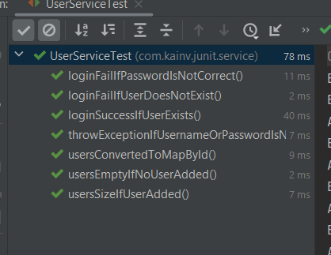
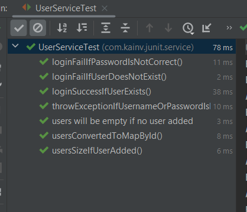
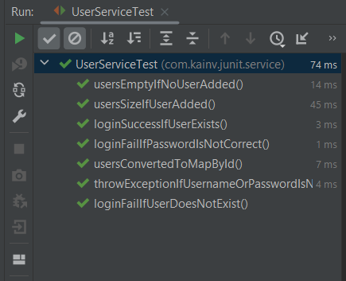
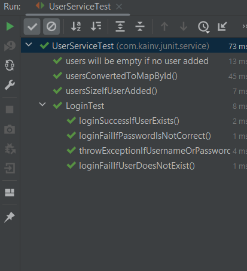
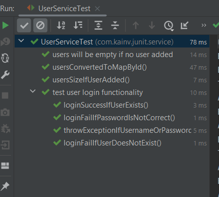

JUnit 5. 10. Tests order. Nested tests
======================================

Не стоит отталкиваться от того, что наши методы будут вызываться в определенном порядке потому что этот порядок в JUnit 5 не определён. Т.е. есть какой-то алгоритм, который запускает наши методы тестовые в каких то классах тестовых. Но он чисто используется для того чтобы при запуске нашего тестового класса эти методы всегда запускались в одном и том же порядке. Но сам порядок не гарантирован. Даже есть такой _chain gang anti-pattern_ который как раз таки и описывает нашу ситуацию когда завязываемся на порядок выполнения наших тестов. Тем не менее в JUnit 5 есть возможность указать порядок. На практике лучше стараться не использовать это средство. За это отвечает аннотация `@TestMethodOrder()`, куда передаём класс, который наследуется от `MethodOrdered`. Это интерфейс, в котором есть пять реализаций:

1.  **MethodName** - по названию наших методов в алфавитном порядке будут вызываться все наши тесты устанавливаем аннотацию `@TestMethodOrder(MethodOrderer.MethodName.class)`. Запускаем и видим:  
    
2.  **DisplayName** - на самом деле это то название, которое получаем при отображении этих тестов. Не названия методов, а отображение названий этих методов. Для того чтобы создать DisplayName используем специальную аннотацию `@DisplayName()` куда передаём уже строку. Например:  
    **UserServiceTest.java**

        @Test
        @Order(1)
        @DisplayName("users will be empty if no user added")
        void usersEmptyIfNoUserAdded() {
            System.out.println("Test 1: " + this);

            List<User> users = userService.getAll();

            MatcherAssert.assertThat(users, IsEmptyCollection.empty());
            assertTrue(users.isEmpty(), () -> "User list should be empty");
        }

    И при запуске операция будет именно на `@DisplayName()`:

3.  **OrderAnnotation** - используется если хотим помечать все тесты аннотацией `@Order`. Т.е. дополнительно каждый тест помечается аннотацией `@Order` и в ней есть один параметр обязательный: `value`. Т.е. нумерация от 1 до бесконечности.

        package com.kainv.junit.service;

        import com.kainv.dto.User;
        import com.kainv.service.UserService;
        import org.hamcrest.MatcherAssert;
        import org.hamcrest.collection.IsEmptyCollection;
        import org.hamcrest.collection.IsMapContaining;
        import org.junit.jupiter.api.\*;

        import java.util.List;
        import java.util.Map;
        import java.util.Optional;

        import static org.assertj.core.api.Assertions.assertThat;
        import static org.junit.jupiter.api.Assertions.\*;

        @Tag("fast")
        @Tag("user")
        @TestInstance(TestInstance.Lifecycle.PER\_CLASS)
        @TestMethodOrder(MethodOrderer.OrderAnnotation.class)
        public class UserServiceTest {

            private UserService userService;
            private static final User VADIM = User.of(1, "Vadim", "123");
            private static final User PETR = User.of(2, "Petr", "123");

            @BeforeAll
            void init() {
                System.out.println("Before all" + this);
            }

            @BeforeEach
            void prepare() {
                System.out.println("Before each: " + this);
                userService = new UserService();
            }

            @Test
            @Order(1)
            void usersEmptyIfNoUserAdded() {
                System.out.println("Test 1: " + this);

                List<User> users = userService.getAll();

                MatcherAssert.assertThat(users, IsEmptyCollection.empty());
                assertTrue(users.isEmpty(), () -> "User list should be empty");
            }

            @Test
            @Order(2)
            void usersSizeIfUserAdded() {
                System.out.println("Test 2: " + this);

                userService.add(VADIM);
                userService.add(PETR);

                // Делаем проверку на кол-во пользователей в приложении
                List<User> users = userService.getAll();

                assertThat(users).hasSize(2);
        //        assertEquals(2, users.size());
            }

            @Test
            @Tag("login")
            void loginSuccessIfUserExists() {
                userService.add(VADIM);
                userService.add(PETR);

                Optional<User> maybeUser = userService.login(VADIM.getUsername(), VADIM.getPassword());

                // Проверяем, что такой пользователь существует
                assertThat(maybeUser).isPresent();
        //        assertTrue(maybeUser.isPresent());
                // Проверяем, действительно ли это тот пользователь (первый параметр - ожидаемый, второй - фактический)
                maybeUser.ifPresent(user -> assertThat(user).isEqualTo(VADIM));
        //        maybeUser.ifPresent(user -> assertEquals(VADIM, user));
            }

            @Test
            @Tag("login")
            void throwExceptionIfUsernameOrPasswordIsNull() {
                assertAll(
                        () -> {
                            IllegalArgumentException argumentException = assertThrows(IllegalArgumentException.class, () -> userService.login(null, "some password"));
                            assertThat(argumentException.getMessage()).isEqualTo("username or password is null");
                        },
                        () -> assertThrows(IllegalArgumentException.class, () -> userService.login("some username", null))
                );
            }

            @Test
            @Tag("login")
            void loginFailIfPasswordIsNotCorrect() {
                userService.add(VADIM);

                Optional<User> maybeUser = userService.login(VADIM.getUsername(), "incorrect");

                assertTrue(maybeUser.isEmpty());
            }

            @Test
            void usersConvertedToMapById() {
                userService.add(VADIM, PETR);

                Map<Integer, User> users = userService.getAllConvertedById();

                MatcherAssert.assertThat(users, IsMapContaining.hasKey(VADIM.getId()));

                assertAll(
                        () ->
                                // В результирующей коллекции проверяем на содержание ID для Вадима и Петра
                                assertThat(users).containsKeys(VADIM.getId(), PETR.getId()),
                        () ->
                                // Проверяем Map не только на содержание, но и значений
                                assertThat(users).containsValues(VADIM, PETR)
                );
            }

            @Test
            @Tag("login")
            void loginFailIfUserDoesNotExist() {
                userService.add(VADIM);

                Optional<User> maybeUser = userService.login("Dima", VADIM.getPassword());

                assertTrue(maybeUser.isEmpty());
            }

            @AfterEach
            void deleteDataFromDatabase() {
                System.out.println("After each: " + this);
            }

            @AfterAll
            void closeConnectionPool() {
                System.out.println("After all" + this);
            }
        }

    

    Видим, что тесты в которых пометили порядок - запустились первыми по порядку. Остальные запустились в неопределённом порядке.

4.  **Random** - каждый раз когда вызываем тесты в `UserServiceTest` все наши тесты будут выполнятся в рандомном порядке.

Лучше **не использовать** `@TestMethodOrder` вовсе чтобы не реализовывать наш _chain gang anti-pattern_ и избегать всяких _flaky tests_ (позже будут объяснения). `@DisplayName` можно использовать, чтобы улучшить название наших тестовых методов когда их запускаем. Более того, для того чтобы пойти ещё дальше, улучшить читабельность тестов и как то их разделить.

Например у нас много методов связанных с логином поэтому можем использовать т.н. nested-classes. Т.е. можем создать внутренний класс и туда перенести все тестовые методы, которые связаны с логином:

    package com.kainv.junit.service;

    import com.kainv.dto.User;
    import com.kainv.service.UserService;
    import org.hamcrest.MatcherAssert;
    import org.hamcrest.collection.IsEmptyCollection;
    import org.hamcrest.collection.IsMapContaining;
    import org.junit.jupiter.api.\*;

    import java.util.List;
    import java.util.Map;
    import java.util.Optional;

    import static org.assertj.core.api.Assertions.assertThat;
    import static org.junit.jupiter.api.Assertions.\*;

    @Tag("fast")
    @Tag("user")
    @TestInstance(TestInstance.Lifecycle.PER\_CLASS)
    @TestMethodOrder(MethodOrderer.DisplayName.class)
    public class UserServiceTest {

        private UserService userService;
        private static final User VADIM = User.of(1, "Vadim", "123");
        private static final User PETR = User.of(2, "Petr", "123");

        @BeforeAll
        void init() {
            System.out.println("Before all" + this);
        }

        @BeforeEach
        void prepare() {
            System.out.println("Before each: " + this);
            userService = new UserService();
        }

        @Test
        @Order(1)
        @DisplayName("users will be empty if no user added")
        void usersEmptyIfNoUserAdded() {
            System.out.println("Test 1: " + this);

            List<User> users = userService.getAll();

            MatcherAssert.assertThat(users, IsEmptyCollection.empty());
            assertTrue(users.isEmpty(), () -> "User list should be empty");
        }

        @Test
        @Order(2)
        void usersSizeIfUserAdded() {
            System.out.println("Test 2: " + this);

            userService.add(VADIM);
            userService.add(PETR);

            // Делаем проверку на кол-во пользователей в приложении
            List<User> users = userService.getAll();

            assertThat(users).hasSize(2);
    //        assertEquals(2, users.size());
        }

        @Test
        void usersConvertedToMapById() {
            userService.add(VADIM, PETR);

            Map<Integer, User> users = userService.getAllConvertedById();

            MatcherAssert.assertThat(users, IsMapContaining.hasKey(VADIM.getId()));

            assertAll(
                    () ->
                            // В результирующей коллекции проверяем на содержание ID для Вадима и Петра
                            assertThat(users).containsKeys(VADIM.getId(), PETR.getId()),
                    () ->
                            // Проверяем Map не только на содержание, но и значений
                            assertThat(users).containsValues(VADIM, PETR)
            );
        }

        @AfterEach
        void deleteDataFromDatabase() {
            System.out.println("After each: " + this);
        }

        @AfterAll
        void closeConnectionPool() {
            System.out.println("After all" + this);
        }

        @Nested
        @Tag("login")
        class LoginTest {
            @Test
            void loginSuccessIfUserExists() {
                userService.add(VADIM);
                userService.add(PETR);

                Optional<User> maybeUser = userService.login(VADIM.getUsername(), VADIM.getPassword());

                // Проверяем, что такой пользователь существует
                assertThat(maybeUser).isPresent();
    //        assertTrue(maybeUser.isPresent());
                // Проверяем, действительно ли это тот пользователь (первый параметр - ожидаемый, второй - фактический)
                maybeUser.ifPresent(user -> assertThat(user).isEqualTo(VADIM));
    //        maybeUser.ifPresent(user -> assertEquals(VADIM, user));
            }

            @Test
            void throwExceptionIfUsernameOrPasswordIsNull() {
                assertAll(
                        () -> {
                            IllegalArgumentException argumentException = assertThrows(IllegalArgumentException.class, () -> userService.login(null, "some password"));
                            assertThat(argumentException.getMessage()).isEqualTo("username or password is null");
                        },
                        () -> assertThrows(IllegalArgumentException.class, () -> userService.login("some username", null))
                );
            }

            @Test
            void loginFailIfPasswordIsNotCorrect() {
                userService.add(VADIM);

                Optional<User> maybeUser = userService.login(VADIM.getUsername(), "incorrect");

                assertTrue(maybeUser.isEmpty());
            }

            @Test
            void loginFailIfUserDoesNotExist() {
                userService.add(VADIM);

                Optional<User> maybeUser = userService.login("Dima", VADIM.getPassword());

                assertTrue(maybeUser.isEmpty());
            }
        }
    }

Теперь нет нужды помечать аннотацией `@Tag("")` потому что можно поставить аннотацию над классом (все методы внутри будут автоматически с этим тэгом). Чтобы внутренний класс был как обычные тесты, мы должны его пометить аннотацией `@Nested`.

Запускаем и проверяем:

Более того, наш `@DisplayName("")` можно использовать над `@Nested` классами и не только. Следовательно, можем улучшить читабельность кода:

    @Nested
    @DisplayName("test user login functionality")
    @Tag("login")
    class LoginTest {

