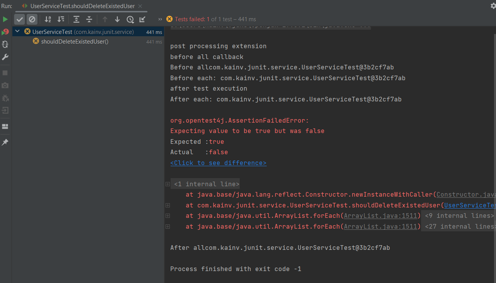
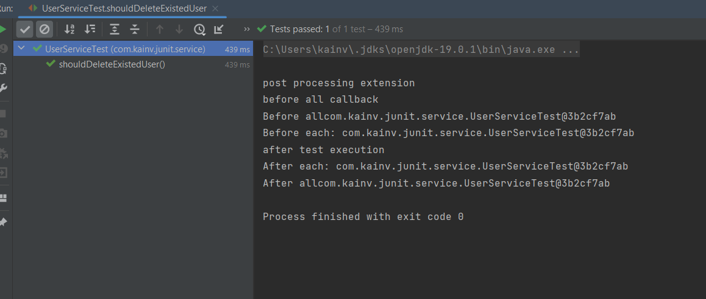
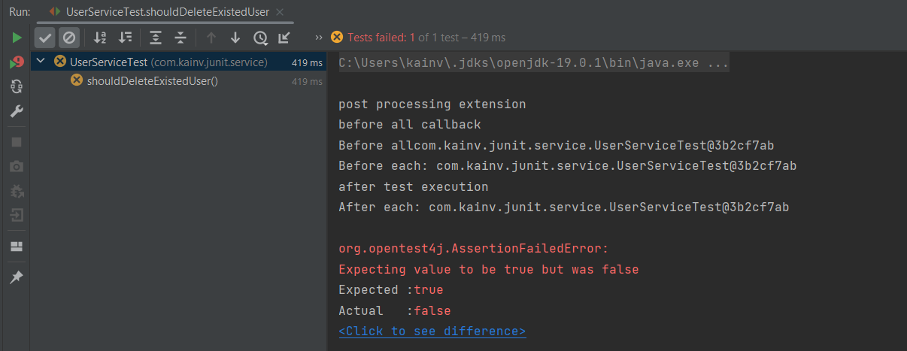
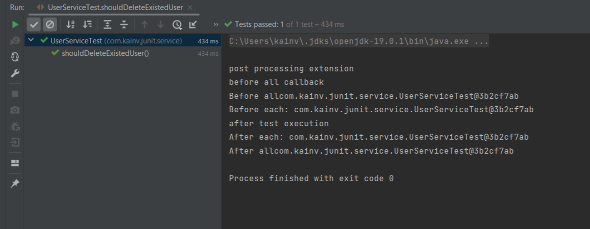
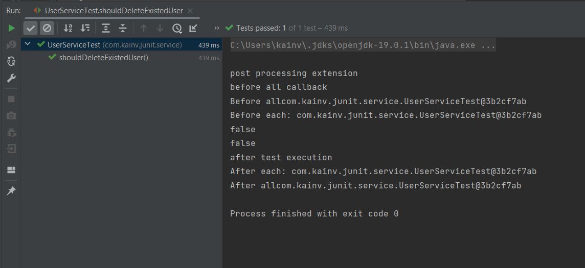

JUnit 5. 17. Mockito. Mock
==========================

Mock
----

Начнём с часто используемого - Mock. Во время использования наших моков мы будем сталкиваться и со stub'ами, и с fake'ами, и с dummy.

Для начала нам нужно сделать `UserService` более реалистичным, т.е. добавить зависимость на `UserDao`. Создадим класс `UserDao` от которого будет зависеть `UserService`:

    package com.kainv.dao;

    import lombok.SneakyThrows;

    import java.sql.Connection;
    import java.sql.DriverManager;

    public class UserDao {
        @SneakyThrows
        public boolean delete(Integer userId) {
            try (Connection connection = DriverManager.getConnection("url", "username", "password")) {
                return true;
            }
        }
    }

Возвращаемся в `UserService`, переопределяем конструктор и добавляем метод по удалению нашего пользователя т.е. в `UserService` приходит метод для удаления пользователя и он просто перенаправляет его на `UserDao` поэтому пишем:

    package com.kainv.service;

    import com.kainv.dao.UserDao;
    import com.kainv.dto.User;

    import java.util.\*;

    import static java.util.function.Function.identity;
    import static java.util.stream.Collectors.toMap;

    public class UserService {

        private final List<User> users = new ArrayList<>();
        private final UserDao userDao;

        public UserService(UserDao userDao) {
            this.userDao = userDao;
        }

        public boolean delete(Integer userId) {
            return userDao.delete(userId);
        }

        public List<User> getAll() {
            return users;
        }

        public void add(User... users) {
            this.users.addAll(Arrays.asList(users));
        }

        public Optional<User> login(String username, String password) {
            if (username == null || password == null) {
                throw new IllegalArgumentException("username or password is null");
            }
            return users.stream()
                    .filter(user -> user.getUsername().equals(username))
                    .filter(user -> user.getPassword().equals(password))
                    .findFirst();
        }

        public Map<Integer, User> getAllConvertedById() {
            return users.stream().collect(toMap(User::getId, identity()));
        }
    }

Теперь видим, что если напишем тест на метод `delete()`, то это будет уже **интеграционный** тест. Потому что мы проверяем не только логику метода нашего `delete()` у `UserService`, но и логику работы нашего метода `delete()` у `UserDao`. Т.е. два совершенно разных класса, следственно это интеграционный тест как `UserService` дружит с `UserDao`.

### Напишем тест на метод delete() в UserService

Переходим в `UserServiceTest` и пишем тест. Предварительно нужно закоментировать `ThrowableExtension.class` в `@ExtendWith({})` потому что он ловит все наши исключения и говорит что тесты прошли.

**UserServiceTest.java**

    @Test
    void shouldDeleteExistedUser() {
        userService.add(VADIM);

        boolean deleteResult = userService.delete(VADIM.getId());

        assertThat(deleteResult).isTrue();
    }

Если запустим, то тесты упадут потому что зайдя в `UserDao` и вызвав метод `delete()` мы не смогли подключиться к БД. Следственно, это уже интеграционный тест. Следственно, мы должны использовать **Mockito**.

Для этого нам нужно проинициализировать наш `UserService`. Не будем использовать наш DI-механизм. Во-первых добавляем `UserDao` как поле в нашем `UserServiceTest` классе:

**UserServiceTest.java**

        private UserDao userDao;

И теперь его тоже надо проинициализоровать и передать в `UserService` в методе `prepare()`. Мы не можем напрямую передать `this.userDao = new UserDao();`. Для этого нам нужен какой-то mock-объект который мы в дальнейшем будем программировать. Мы не должны реальные методы вызывать у `UserDao` поэтому используем метод `Mockito.mock()`, который создаёт прокси-объект с таким же классом который мы передали в него в качестве параметра:

**UserServiceTest.java**

    @BeforeEach
    void prepare() {
        System.out.println("Before each: " + this);
        this.userDao = Mockito.mock(UserDao.class);
        this.userService = new UserService(userDao);
    }

Теперь, если запустим тест, то реальный метод не вызовется. Но тесты и не выполнятся.

Сначала разберёмся почему вернулся false, а во вторых, что это за Mock объект.

### Создадим mock-объект вручную

    package com.kainv.junit.dao;

    import com.kainv.dao.UserDao;

    public class UserDaoMock extends UserDao {
        @Override
        public boolean delete(Integer userId) {
            return false;
        }
    }

Мы можем использовать его вместо реального `UserDao` потому что он наследуется от него и переопределяет все его методы. Возвращаются, как правило, какие-то дефолтные значения. Для примитивных типов это обычные дефолтные значения (для boolean - false, для целочисленных - 0 и т.д.), для объектов сложных это null, для коллекций это обычные пустые коллекции.

Т.к. `UserDaoMock` наследуется от `UserDao`, следственно мы можем его использовать везде где используется `UserDao`. Но тут опять видим ограничения потому что мы не можем сделать `final class UserDao` потому что тогда не сможем наследоваться от него.

Мы опять приходим к двум вариантам создания mock-ов: это динамическое прокси и наследование как это делает Mockito и Spring. Наш класс **не должен быть** `final` иначе будет исключение.

### Возвращаемся в UserServiceTest

Мы добавили `UserDao`, но теперь хотим его как-то запрограммировать чтобы при удалении именно в `userService.delete(VADIM.getId());`, именно наш `userDao` должен вернуть true или false. Мы должны научить его делать потому что по умолчанию он возвращает дефолтное значение false.

**UserServiceTest.java**

    @Test
    void shouldDeleteExistedUser() {
        userService.add(VADIM);

        boolean deleteResult = userService.delete(VADIM.getId());

        assertThat(deleteResult).isTrue();
    }

Для этого опять же воспользуемся Mockito и пишем:

        @Test
        void shouldDeleteExistedUser() {
            userService.add(VADIM);

    //        STUB: верни true, когда у userDao вызовем метод delete и передадим туда VADIM.getId()
            Mockito.doReturn(true).when(userDao).delete(VADIM.getId());

            boolean deleteResult = userService.delete(VADIM.getId());

            assertThat(deleteResult).isTrue();
        }

Мы создали **Stub** для ответа на вызов метода mock'ом. Т.е. говорим: верни true, когда у userDao вызовем метод delete и передадим туда VADIM.getId(). В данном случае нас **интересует** этот id'шник следственно это фейковый идшник, но если он нас **не интересует**, то мы на любой переданный ид в метод `delete()` в `UserDao` хотим вернуть true. Тогда мы используем **dummy**\-объект. Т.е. у мокито есть куча методов типа `any()`:

**UserServiceTest**

        @Test
        void shouldDeleteExistedUser() {
            userService.add(VADIM);

    //        STUB: верни true, когда у userDao вызовем метод delete и передадим туда VADIM.getId()
            Mockito.doReturn(true).when(userDao).delete(VADIM.getId());

    //        Если никакой ид не интересует
    //        Mockito.doReturn(true).when(userDao).delete(Mockito.any());

            boolean deleteResult = userService.delete(VADIM.getId());

            assertThat(deleteResult).isTrue();
        }

Запустим и проверим что получится:

В этот раз вернул уже true.

Как это работает
----------------

Как мы научили `UserDao` возвращать результат true, когда передаём какой-то определенный идшник?

Всё очень просто: напишем что-то вроде ассоциативного массива:

    package com.kainv.junit.dao;

    import com.kainv.dao.UserDao;

    import java.util.HashMap;
    import java.util.Map;

    public class UserDaoMock extends UserDao {

        // Ключ Integer потому что аргумент типа Integer и значение Boolean потому что метод возвращает boolean
        private Map<Integer, Boolean> answers = new HashMap<>();
        @Override
        public boolean delete(Integer userId) {
            return answers.getOrDefault(userId, false);
        }
    }

Теперь, каждый раз когда мы обучаем наш `UserDaoMock` - мы просто у нашего `answers` берём результат по ключу. Теперь, каждый раз когда обучаем наш `UserDaoMock` - мы просто берём у нашего `answers` результат по ключу иначе возвращаем false. Для того чтобы обучить этот `answers` - мы используем утилитный класс мокито и добавляем туда значения. Например, по id 1 верни true и т.д..

Этот метод не универсальный потому что у нас могут быть другие типы данных и несколько параметров. Следственно, это все уже решено за нас и у нас есть специальный класс как `Answer` (_stubbing_ - пакет в мокито который занимается созданием **stub**'ов). `Answer1`, `Answer2` и т.д. говорит о кол-ве аргументов в методе.

    package com.kainv.junit.dao;

    import com.kainv.dao.UserDao;
    import org.mockito.stubbing.Answer1;

    import java.util.HashMap;
    import java.util.Map;

    public class UserDaoMock extends UserDao {

        // Ключ Integer потому что аргумент типа Integer и значение Boolean потому что метод возвращает boolean
        private Map<Integer, Boolean> answers = new HashMap<>();
        private Answer1<Integer, Boolean> answer1;
        @Override
        public boolean delete(Integer userId) {
            return answers.getOrDefault(userId, false);
        }
    }

Возвращаемся в UserServiceTest
------------------------------

Если передадим в `userService.delete(2)`, то тест упадёт потому что вернёт единичку:

**UserServiceTest.java**

        @Test
        void shouldDeleteExistedUser() {
            userService.add(VADIM);

    //        STUB: верни true, когда у userDao вызовем метод delete и передадим туда VADIM.getId()
            Mockito.doReturn(true).when(userDao).delete(VADIM.getId());

    //        Если никакой ид не интересует
    //        Mockito.doReturn(true).when(userDao).delete(Mockito.any());

            boolean deleteResult = userService.delete(2);

            assertThat(deleteResult).isTrue();
        }

 **UserServiceTest.java**

        @Test
        void shouldDeleteExistedUser() {
            userService.add(VADIM);

    //        STUB: верни true, когда у userDao вызовем метод delete и передадим туда VADIM.getId()
    //        Mockito.doReturn(true).when(userDao).delete(VADIM.getId());

    //        Если никакой ид не интересует
            Mockito.doReturn(true).when(userDao).delete(Mockito.any());

            boolean deleteResult = userService.delete(2);

            assertThat(deleteResult).isTrue();
        }

В этот раз тест пройден потому что нас не интересует идентификатор, мы в любом случае возвращаем true. Таким образом можем программировать `Mockito.doReturn()` и возвращать любое значение которое только захотим.

### Второй вариант программирования

**UserServiceTest.java**

        @Test
        void shouldDeleteExistedUser() {
            userService.add(VADIM);

    //        STUB: верни true, когда у userDao вызовем метод delete и передадим туда VADIM.getId()
    //        Mockito.doReturn(true).when(userDao).delete(VADIM.getId());

    //        Если никакой ид не интересует
    //        Mockito.doReturn(true).when(userDao).delete(Mockito.any());

            Mockito.when(userDao.delete(VADIM.getId())).thenReturn(true);

            boolean deleteResult = userService.delete(2);

            assertThat(deleteResult).isTrue();
        }

Этот вариант тоже работает, но не для всех случаев. Первый вариант является предпочтительнее потому что он является универсальным. Второй вариант позволяет последовательно возвращать значения если будем вызывать у одного и того же mock'а несколько раз метод `delete()` чтобы он возвращал сначала true, а потом false:

**UserServiceTest.java**

        @Test
        void shouldDeleteExistedUser() {
            userService.add(VADIM);

    //        STUB: верни true, когда у userDao вызовем метод delete и передадим туда VADIM.getId()
    //        Mockito.doReturn(true).when(userDao).delete(VADIM.getId());

    //        Если никакой ид не интересует
    //        Mockito.doReturn(true).when(userDao).delete(Mockito.any());

            Mockito.when(userDao.delete(VADIM.getId()))
                    .thenReturn(true)
                    .thenReturn(false);

            boolean deleteResult = userService.delete(VADIM.getId());
            System.out.println(userService.delete(VADIM.getId()));
            System.out.println(userService.delete(VADIM.getId()));

            assertThat(deleteResult).isTrue();
        }

