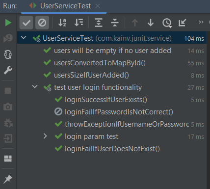
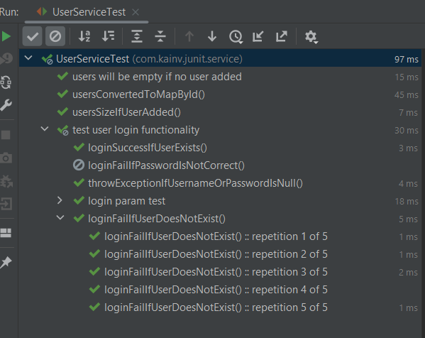
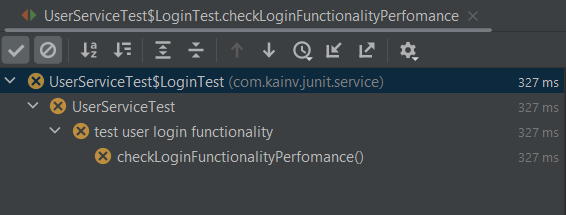
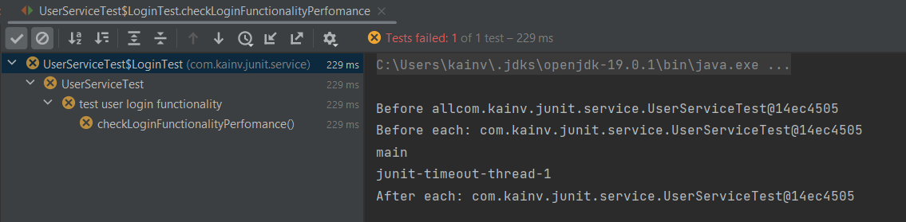

JUnit 5. 13. Flaky tests. Timeouts
==================================

**Flaky tests** означает, что тест не стабильный. Т.е когда запускаем наши тесты во время разработки, то бывает падают тесты в рандомном месте при чем после перезапуска они могут их даже проходить при чем несколько раз. Но например на четвертый запуск вновь упали. Это может быть связано как с неправильной реализацией этих тестов. Опять же возвращаемся к порядку следований этих тестов. Это все тот же относится к тому, что мы не должны завязываться на порядок выполнения тестов в нашем коде. Более того, это часто относится к integration и даже acceptance тестам, которые задействуют например состояние нашей базы данных и могут изменять данные в ней. И не почистив за собой что повлечёт за собой негативные изменения в других тестах, которые планировали получить другой датасет в базе данных.

Поэтому так как по умолчанию поля тестов не детерминированы, следовательно, могут падать различные тесты в рандомном месте. _Что обычно делают программисты:_ находят этот тест (например `loginFailIfPasswordIsNotCorrect`) и помечают аннотацией `@Disabled`. Т.е. эта аннотация позволяет не запускать наш тест в следующий раз. Обычно пишут комментарий, у этой аннотации есть всего лишь одно поле - это `value` и, например пишут:

**UserServiceTest.java**

        @Test
        @Disabled("flaky, need to see")
        void loginFailIfPasswordIsNotCorrect() {
            userService.add(VADIM);

            Optional<User> maybeUser = userService.login(VADIM.getUsername(), "incorrect");

            assertTrue(maybeUser.isEmpty());
        }

**Второй вариант**, как уменьшить кол-во flaky test'ов - это сделать их **repeatable**. Т.е. есть ещё одна аннотация `@RepeatedTest()` в котором указывает сколько повторений должно быть и его название (есть по умолчанию):

**UserServiceTest.java**

    //        @Test
            @RepeatedTest(value = 5, name = RepeatedTest.LONG\_DISPLAY\_NAME)
            void loginFailIfUserDoesNotExist() {
                userService.add(VADIM);
    
                Optional<User> maybeUser = userService.login("Dima", VADIM.getPassword());
    
                assertTrue(maybeUser.isEmpty());
            }

Таким образом мы можем улучшить наши тесты, которые поддержаны к тому, чтобы поддерживать наши flacky. Т.е. например на 3 и 4 итерации часто падает тест, хотя предыдущие два проходят. Таким образом уменьшаем кол-во таких flacky-тестов. Более того, можем использовать DI механизм и передать `RepetitionInfo`. По сути, это информация про кол-во итераций, про текущую итерации:

**UserServiceTest.java**

    //        @Test
            @RepeatedTest(value = 5, name = RepeatedTest.LONG\_DISPLAY\_NAME)
            void loginFailIfUserDoesNotExist(RepetitionInfo repetitionInfo) {
                userService.add(VADIM);
    
                Optional<User> maybeUser = userService.login("Dima", VADIM.getPassword());
    
                assertTrue(maybeUser.isEmpty());
            }

Timeout'ы
---------

На одном из предыдущих занятий мы видили, что в старом JUnit 4 ( `@org.junit.Test(expected = IllegalArgumentException.class)`) кроме значения `expected` был ещё один - это `long timeout`. Т.е. могли таймауты на ограничения во время выполнения нашего теста. Естественно для юнит тестов он **не годится**, но для интеграционных, а скорее для acceptance-тестов вполне себе **годится** потому что они могут занимать довольно много времени.

Например, наш логин можем протестировать следующим образом:

**UserServiceTest.java**

            @Test
            void checkLoginFunctionalityPerfomance() {
    //            Тестируем время выполнения нашего теста
                Optional<User> result = assertTimeout(
                        Duration.ofMillis(200L),
                        () -> {
                            Thread.sleep(300L);
                            return userService.login("Dima", VADIM.getPassword());
                        }
                );

            }

Видим, что тест провален потому что ожидали время выполнения не более 200мс, а выполнилось более чем за 300мс.

Так же есть другой ассерт, это `assertTimeoutPreemptively()`, который отличается лишь тем, что выполняется наш метод в отдельном потоке. В этом случае получаем разные потоки:

**UserServiceTest.java**

            @Test
            void checkLoginFunctionalityPerfomance() {
                System.out.println(Thread.currentThread().getName());
    //            Тестируем время выполнения нашего теста
                Optional<User> result = assertTimeoutPreemptively(
                        Duration.ofMillis(200L),
                        () -> {
                            System.out.println(Thread.currentThread().getName());
                            Thread.sleep(300L);
                            return userService.login("Dima", VADIM.getPassword());
                        }
                );
    
            }

Сначала видим поток _main_, а затем поток _junit-timeout-thread-1_. Т.е. запущен в другом потоке.

Чаще всего используется `assertTimeout()` потому что множество функциональностей, например в спринге связанной с транзакциями завязано на такие переменные как `ThreadLocal`, который использует объект текущего потока в качестве ключа для определения транзакций. Поэтому чаще прибегают к обычным `assertTimeout()`.

Есть так же отдельная аннотация `@Timeout()`, в котором в качестве параметра принимаем значение и время в мс (`long value`). В нашем случае ожидаем 200мс, то делаем следующее:

Мы так же можем указывать его как над методами, так и над классами. Поставим его над внутренним классом `@Timeout(value = 200, unit = TimeUnit.MILLISECONDS)`:

**UserServiceTest.java**

    @Nested
    @DisplayName("test user login functionality")
    @Tag("login")
    @Timeout(value = 200, unit = TimeUnit.MILLISECONDS)
    class LoginTest {