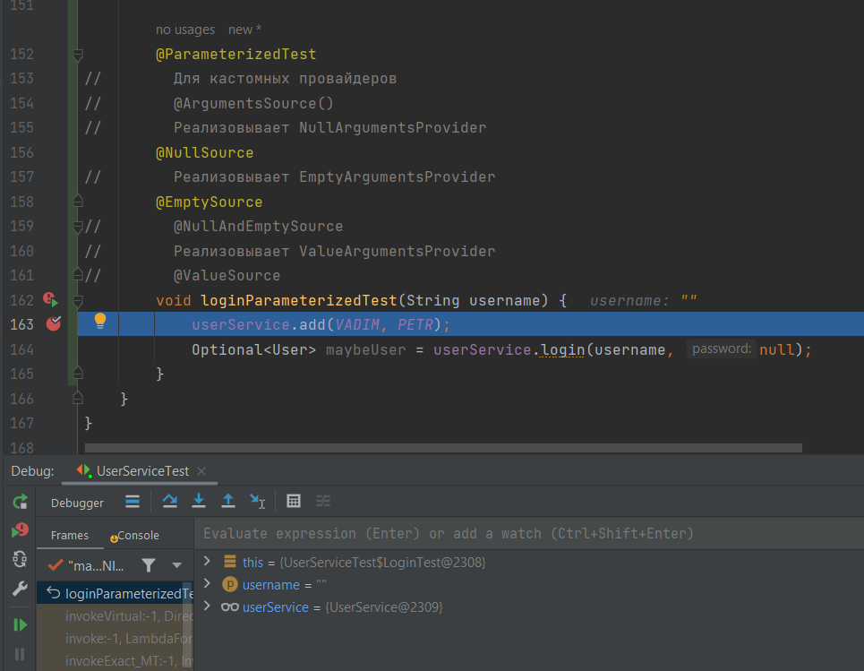
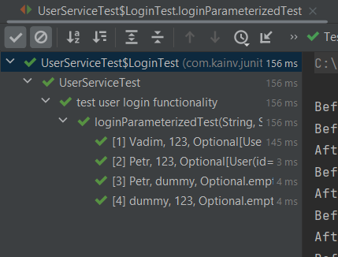
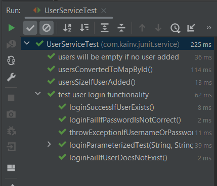
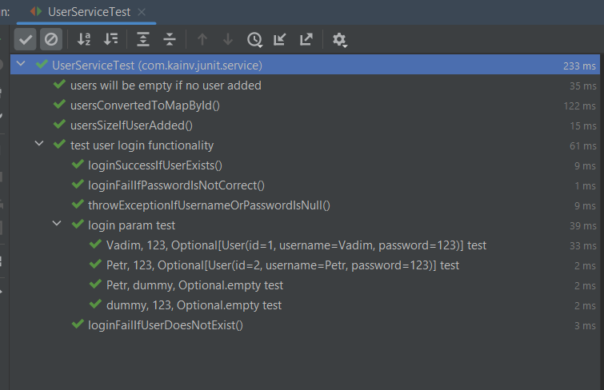

JUnit 5. 12. Parameterized Tests
================================

DI механизм принёс очень много полезных изменений. Т.е. на основании DI у нас появилась возможность использовать такие вещи как **параметризованные тесты**.

Посмотрим что такое параметризованные тесты
-------------------------------------------

Но для этого нам необходимо подключить дополнительную зависимость:

        <dependency>
            <groupId>org.junit.jupiter</groupId>
            <artifactId>junit-jupiter-params</artifactId>
            <version>5.8.0-M1</version>
            <scope>test</scope>
        </dependency>

У нас появляется новая возможность писать тесты именно параметризованные тесты. Вместо того чтобы писать аннотацию `@Test` мы используем `@ParameterizedTest`. Далее пишем как обычный тест и например хотим протестировать нашу логин-функциональность большинством тест-кейсов. Т.е. когда у нас есть существующий юзер и несуществующий, и проблема с юзернеймом, паролем и т.д.. Т.е. этим кейсом можем закрыть сразу множество тест-кейсов. Для этого как раз таки подходят параметризованные тесты.

И теперь, суть его в том, что мы пишем, как обычно, но в методы передаём аргументы из параметризованного теста. Т.е. берутся из DI-механизма. Мы просто просим предоставить нам поля `String username, String password`.

Теперь, чтобы подставить username & password мы тоже должны предоставить какой-то класс, либо функциональность, которая предоставит нам эти значения с помощью DI. И для этого вместе с `@ParameterizedTest` всегда используется ещё одна аннотация: `@ArgumentsSource()`. Эту аннотацию можно ставить как над аннотацией, так и методом. Внутри себя он содержит `value()`, который представляет класс-провайдер. Его единственная задача: предоставить поток аргументов в наш метод. Он занимается тем, что находит наши аргументы (в нашем случае username и password) и это все представляется в виде аргументов. А аргумент - это всего лишь интерфейс, который возвращает массив объектов. Т.е. если у нас к примеру два параметра в нашем методе, то это массив из двух элементов.

Есть уже множество готовых провайдеров. Мы можем ими воспользоваться чтобы не писать свои провайдеры:

            @ParameterizedTest
    //        Для кастомных провайдеров
    //        @ArgumentsSource()
    //        Реализовывает NullArgumentsProvider
            @NullSource
    //        Реализовывает EmptyArgumentsProvider
            @EmptySource
    //        Реализовывает ValueArgumentsProvider
            @ValueSource
            void loginParameterizedTest(String username, String password) {
                userService.add(VADIM, PETR);
                Optional<User> maybeUser = userService.login(username, password);
            }

Не сложно догадаться, что наши провайдеры подставляют значения в параметры. Единственное ограничение, что параметр должен быть один. В нашем случае username и password - это два параметра и следовательно, что для `@NullSource`, что и для `@EmptySource`, `@ValueSource` есть ограничения в один единственный параметр. Поэтому и используют их довольно редко. Но если у нас одна красивая функция с одним параметром, то это отличный вариант использовать `@NullSource`,`@EmptySource`, `@ValueSource`.

Уберём один аргумент и запустим код в дебаге:

            @ParameterizedTest
    //        Для кастомных провайдеров
    //        @ArgumentsSource()
    //        Реализовывает NullArgumentsProvider
            @NullSource
    //        Реализовывает EmptyArgumentsProvider
            @EmptySource
    //        @NullAndEmptySource
    //        Реализовывает ValueArgumentsProvider
    //        @ValueSource
            void loginParameterizedTest(String username) {
                userService.add(VADIM, PETR);
                Optional<User> maybeUser = userService.login(username, null);
            }

Видим пустое значение в username потому что со String он работает так же как с массивами и коллекциями. `@ValueSource` работает так же только с одним параметром. Например, в данном случае если у нас только один параметр, то я могу предоставить `strings`:

**UserServiceTest.java**

            @ParameterizedTest
    //        Для кастомных провайдеров
    //        @ArgumentsSource()
    //        Реализовывает NullArgumentsProvider
            @NullSource
    //        Реализовывает EmptyArgumentsProvider
            @EmptySource
    //        @NullAndEmptySource
    //        Реализовывает ValueArgumentsProvider
            @ValueSource(strings = {
                    "Vadim", "Petr"
            })
            void loginParameterizedTest(String username) {
                userService.add(VADIM, PETR);
                Optional<User> maybeUser = userService.login(username, null);
            }

И если запустим дебаг, то в username сначала придёт Vadim, а потом Petr. Есть ещё один тип source'ов - это `@EnumSource`: используется редко - только тогда, когда у нас есть Enum вместо каких-то примитивных типов либо String.

Что нельзя сказать про `@MethodSource` - он используется чаще всего. Мы должны предоставить ему название нашего метода, который примет все эти стримы аргументов. Т.е. я должен передать метод и создать его. Он должен быть статическим и возвращать `Stream<Arguments>`. Есть конечно ограничения, что статические методы нельзя использовать во внутренних классах, следовательно, мы должны его вынести в наш внешний класс. Теперь у нас нет доступа к `getArgumentsForLoginTest` методу потому что он уже находится не во внутреннем классе, а в каком-то другом. Но опять же, у нас есть возможность указывать любой статический метод в `@MethodSource`, не только внутри класса, где пишем метод. Для этого пишем путь к методу. Пусть состоит из полного пути класса, где состоит метод.

**UserServiceTest.java**

            @ParameterizedTest
    //        Для кастомных провайдеров
    //        @ArgumentsSource()
    //        Реализовывает NullArgumentsProvider
    //        @NullSource
    //        Реализовывает EmptyArgumentsProvider
    //        @EmptySource
    //        @NullAndEmptySource
    //        Реализовывает ValueArgumentsProvider
    //        @ValueSource(strings = {
    //                "Vadim", "Petr"
    //        })
    //        @EnumSource
            @MethodSource("com.kainv.junit.service.UserServiceTest#getArgumentsForLoginTest")
            void loginParameterizedTest(String username, String password, Optional<User> user) {
                userService.add(VADIM, PETR);

                Optional<User> maybeUser = userService.login(username, password);

                assertThat(maybeUser).isEqualTo(user);
            }
        }

        static Stream<Arguments> getArgumentsForLoginTest() {
            return Stream.of(
                    Arguments.of("Vadim", "123", Optional.of(VADIM)),
                    Arguments.of("Petr", "123", Optional.of(PETR)),
    //                    Существующий пользователь, но неправильный пароль
                    Arguments.of("Petr", "dummy", Optional.empty()),
    //                    Пользователя не существует, а пароль существует
                    Arguments.of("dummy", "123", Optional.empty())
            );
        }

Таким образом мы можем сразу четыре кейса покрыть тестами. Запускаем наш тест и проверяем:

Мы можем использовать обычный CSV формат и указать просто путь к нему. Для этого в тестовой директории создаём resources и там создаём файл **login-test-data.csv**. Т.е. именно расширение csv. Суть этого формата в том, что мы на каждой строке пишем какие-то значения, которые разделены любым делиметром.

**UserServiceTest.java**

        @ParameterizedTest
        @CsvFileSource(resources = "/login-test-data.csv", delimiter = ',', numLinesToSkip = 1)
        void loginParameterizedTest(String username, String password) {
            userService.add(VADIM, PETR);

            Optional<User> maybeUser = userService.login(username, password);

            assertThat(maybeUser).isEqualTo(null);
        }

Если запустим этот код в дебаге, то в наши параметры передадутся все необходимые данные. Так же чтобы не создавать csv файл мы можем использовать аннотацию `@CsvSource`:

**UserServiceTest.java**

        @ParameterizedTest
        @CsvSource({
                "Vadim,123",
                "Petr,123"
        })
        void loginParameterizedTest(String username, String password) {
            userService.add(VADIM, PETR);

            Optional<User> maybeUser = userService.login(username, password);

            assertThat(maybeUser).isEqualTo(null);
        }

Так же можем именовать тесты при помощи `@ParameterizedTest(name = "")`. Внутри него есть разные _placeholder_'ы:

        @ParameterizedTest(name = "{arguments} test")
        @MethodSource("com.kainv.junit.service.UserServiceTest#getArgumentsForLoginTest")
        void loginParameterizedTest(String username, String password, Optional<User> user) {
            userService.add(VADIM, PETR);

            Optional<User> maybeUser = userService.login(username, password);

            assertThat(maybeUser).isEqualTo(user);
        }

Запустим все тесты и посмотрим на результат:

Если хотим переименовать название теста, то используем обычный `@DisplayName("")`:

**UserServiceTest.java**

        @ParameterizedTest(name = "{arguments} test")
        @MethodSource("com.kainv.junit.service.UserServiceTest#getArgumentsForLoginTest")
        @DisplayName("login param test")
        void loginParameterizedTest(String username, String password, Optional<User> user) {
            userService.add(VADIM, PETR);

            Optional<User> maybeUser = userService.login(username, password);

            assertThat(maybeUser).isEqualTo(user);
        }

