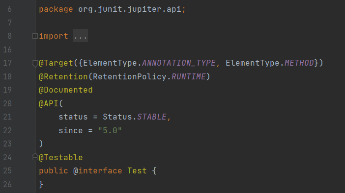
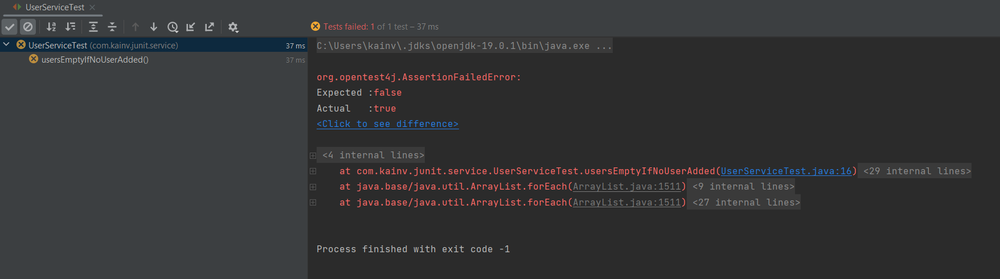
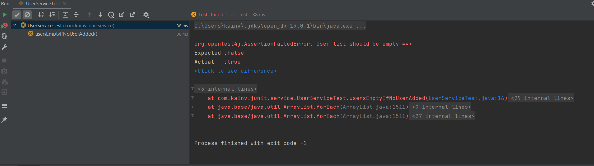

JUnit 5. 3. Аннотация @Test. Assertions
=======================================

Разберёмся как написать тест, общие концепции написания тестов и нейминг конвенции.

Для начала, все наши тесты должны быть в директории src/test/java. Т.е. используем maven или gradle (неважно, поскольку используют одну структуру проектов). Например, если написали `UserServiceTest`, то это означает, что мы тестируем `UserService` класс и этот тест находится в той же самой директории, что и исходник. Используем постфикс Test потому что используем surefire-plugin, который занимается тем, что запускает тесты. Он отслеживает только те классы в директории test, которые заканчиваются на определенный постфикс или префикс. Префиксальный вариант не особо предпочтительный, зато постфиксный по умолчанию это `Test`, `Tests`, `Testcase`.

Далее, сами классы и тесты должны в JUnit 4 должны были быть `public`, но в JUnit 5 такое не надо, поэтому убираем эту конструкцию с классов и тестов:

    package com.kainv.junit.service;

    import org.junit.jupiter.api.Test;

    import static org.junit.jupiter.api.Assertions.\*;

    class UserServiceTest {
        @Test
        void test() {
            assertTrue(false);
        }
    }

Теперь поговорим об именовании тестов. До того как появилась аннотация `@Test`, все тесты имели префикс Test потому что инструменты для запуска этих тестов (например surefire-plugin) отслеживал именование методов и по префиксу запускал те методы, которые начинаются с Test. В JUnit 5 появилась аннотация `@Test`, которая позволила запускать эти тесты невзирая на именование. Следовательно, теперь только те тесты, которые обозначены аннотацией `@Test` запускается нашим плагином. Если перейдём в исходники аннотации, то увидим, что её можно ставить над методами и аннотациями которые хотим запустить для теста:

Мета-аннотация `@Testable` которая используется jupiter test engine просто в качестве мета-информации чтобы отслеживать функционал который можем запустить в качестве тестов.

Создадим экземпляр класса `UserService` и вызовем метод `getAll()` (предварительно создав в src/java/main):

    package com.kainv.junit.service;

    import com.kainv.dto.User;
    import com.kainv.service.UserService;
    import org.junit.jupiter.api.Test;

    import java.util.List;

    import static org.junit.jupiter.api.Assertions.\*;

    class UserServiceTest {
        @Test
        void test() {
            UserService userService = new UserService();
            List<User> users = userService.getAll();
            assertTrue(users.isEmpty());
        }
    }

Мы сначала написали тест, а потом функционал. Такая методология называется **TTD (Test Driven Development)**.

В нашем тесте проверяем, что получаем всех наших пользователей и наша коллекция будет пустая если туда ничего не положили. Теперь можем именовать наш `void test`. Название теста должно полностью отображать что у нас происходит в тесте. Так как это юнит-тест, он проверяет всего лишь маленький функционал, метод один единственный в одном единственном классе. В нашем случае получается:

    package com.kainv.junit.service;

    import com.kainv.dto.User;
    import com.kainv.service.UserService;
    import org.junit.jupiter.api.Test;

    import java.util.List;

    import static org.junit.jupiter.api.Assertions.\*;

    class UserServiceTest {
        @Test
        void usersEmptyIfNoUserAdded() {
            UserService userService = new UserService();
            List<User> users = userService.getAll();
            assertTrue(users.isEmpty());
        }
    }

В именовании можем использовать как SnakeCase так и CamelCase без префиксов и постфиксов, т.к. уже стоит аннотация `@Test`.

Запустим тест и проверим, что он работает: `mvn test`

Видим, что тест успешно запустился и отработал.

Класс `Assertions` необходим для того, чтобы проверять ожидаемое и актуальное значение, которое получили из функций. По сути, всегда в наших тестов подаём на вход input в "черный ящик" Input -> \[box == func\] -> actual output и на выходе получаем актуальные значения. В данном случае `assertTrue` принимает условие и если он true, то тест пройден, иначе тест проваливается. С помощью таких assert'ов происходят наши проверки на ожидаемые и актуальные значения. Так же можно использовать `assertFalse`:

    package com.kainv.junit.service;

    import com.kainv.dto.User;
    import com.kainv.service.UserService;
    import org.junit.jupiter.api.Test;

    import java.util.List;

    import static org.junit.jupiter.api.Assertions.\*;

    class UserServiceTest {
        @Test
        void usersEmptyIfNoUserAdded() {
            UserService userService = new UserService();
            List<User> users = userService.getAll();
            assertFalse(users.isEmpty());
        }
    }

Получаем Test failed и где этот тест зафейлился, в каком методе, каком классе, что ожидали получить и актуальное значение. Так будет всегда: подаём что-то на вход, вызываем функцию и проверяем ожидаемое и актуальное значение при помощи `assertFalse`. Также можем вторым параметром передавать более подробное описание ошибки:

    package com.kainv.junit.service;

    import com.kainv.dto.User;
    import com.kainv.service.UserService;
    import org.junit.jupiter.api.Test;

    import java.util.List;

    import static org.junit.jupiter.api.Assertions.\*;

    class UserServiceTest {
        @Test
        void usersEmptyIfNoUserAdded() {
            UserService userService = new UserService();
            List<User> users = userService.getAll();
            assertFalse(users.isEmpty(), () -> "User list should be empty");
        }
    }

В `assertEquals` мы можем передавать ожидаемые и актуальные данные и они должны совпасть.

`assertThrows` проверяет пробрасывает ли метод какой-то exception.

`assertAll` нужен когда есть несколько assert'ов в нашем методе потому что по best practice было бы неплохо иметь один assert в рамках одного теста потому что если зафейлится тест на строчке 13 а после него был ещё один assert, то мы до него даже не дойдем. Поэтому `assertAll` прекрасный вариант чтобы вызывать сразу несколько assert'ов и получить результат по всем из них.

`assertArrayEquals` тоже самое что и `assertEquals` только проверяет массивы.

И много других assert'ов. По-хорошему их все равно недостаточно поэтому так как JUnit разбит на модули и предполагает нам альтернативы - мы можем подключить дополнительные библиотеки для наших assert'ов (например AssertJ, Hamcrest).