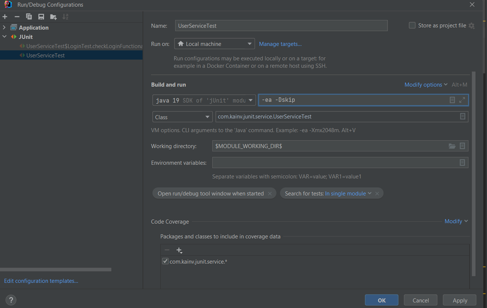
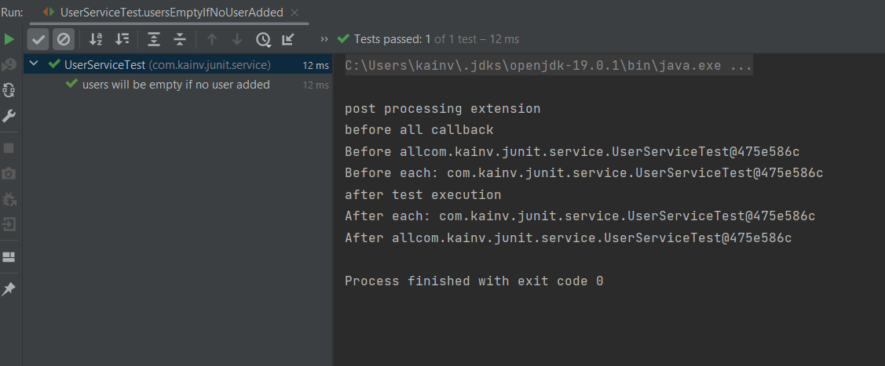

JUnit 5. 15. Extension Model. Практика
======================================

Начнём с модели Test life cycle callbacks
-----------------------------------------

Является самой сложной. Callback'и - это всего лишь интерфейсы реализовав которые мы можем внедриться в любой из этапов жизненного цикла теста. А именно, если посмотрим более детально на эти callback'и, то получается, у нас есть шесть разных callback'ов:

В callback'ах реализуем один единственный метод и он будет вызываться у нас если мы его переопределим и добавим через аннотацию `@ExtendWith({})` нашего тестового класса.

Создадим свой extension, только сначала папку _paramresolver_ переименуем в _extension_ и создадим какой-нибудь `GlobalExtension`. Для того чтобы внедриться в один из шагов жизненного цикла теста, мы всего лишь должны переопределить соответствующие интерфейсы:

    package com.kainv.junit.extension;

    import org.junit.jupiter.api.extension.BeforeAllCallback;
    import org.junit.jupiter.api.extension.ExtensionContext;

    public class GlobalExtension implements BeforeAllCallback {
        @Override
        public void beforeAll(ExtensionContext extensionContext) throws Exception {

        }
    }

Получаем объект типа `ExtensionContext`, следственно мы можем получить всё что захотим. В нашем случае всего лишь пометим, что это _before all callback_:

**GlobalExtension.java**

    @Override
    public void beforeAll(ExtensionContext extensionContext) throws Exception {
        System.out.println("before all callback");
    }

Более того, можем продолжить реализовывать интерфейсы и одним Extension'ом нашим можем реализовать несколько таких интерфейсов и внедриться сразу же одним классом на любые из жизненных циклов тестов. Более того, можем реализовать совершенно любые Extension'ы которые только захотим:

    package com.kainv.junit.extension;

    import org.junit.jupiter.api.extension.AfterTestExecutionCallback;
    import org.junit.jupiter.api.extension.BeforeAllCallback;
    import org.junit.jupiter.api.extension.ExtensionContext;

    public class GlobalExtension implements BeforeAllCallback, AfterTestExecutionCallback {
        @Override
        public void beforeAll(ExtensionContext extensionContext) throws Exception {
            System.out.println("before all callback");
        }

        @Override
        public void afterTestExecution(ExtensionContext extensionContext) throws Exception {
            System.out.println("after test execution");
        }
    }

Теперь, для того чтобы подключить наш Extension, нам нужно в `@ExtendWith({})` подключить наш класс-Execution:

    @ExtendWith({
            UserServiceParamResolver.class,
            GlobalExtension.class
    })
    public class UserServiceTest {

Если выполним запуск тестов, то увидим всё то, что мы реализовали в `GlobalExtension`.

В основном подобные Extension'ы мы используем уже существующими. Свои пишутся довольно редко, только когда хотим предоставить какой-то функционал или общий базовый класс для всех наших тестов. Ведь мы можем создать свой тестовый базовый класс, например в директории _junit_ создаётся какой-то `abstract class TestBase`, который в себе ничего не содержит, но может реализовать какие-то Extension'ы:

    package com.kainv.junit;

    import com.kainv.junit.extension.GlobalExtension;
    import org.junit.jupiter.api.extension.ExtendWith;

    @ExtendWith({
            GlobalExtension.class
    })
    public abstract class TestBase {
    }

Естественно, если будем наследовать наш `TestBase`, то все Extension'ы так же наследуются нашими потомками:

**UserServiceTest.java**

    @ExtendWith({
            UserServiceParamResolver.class,
    //        GlobalExtension.class
    })
    public class UserServiceTest extends TestBase {

Test instance post-processing
-----------------------------

Создадим ещё один Extension, который будет `PostProcessingExtension`:

`Object o` - это мы получаем объект нашего класса. Поменяели на `Object testInstance` для лучшей читабельности.

Именно этот Extension **используется Spring'ом** для внедрения зависимостей. Потому что как раз таки в этом callback'e мы приходим в точку, когда только-только создался объект нашего тестового класса и в нем есть поля от которых хотим зависеть. Следовательно, можем спокойно взять `testInstance`, взять у него все поля и далее пройтись по каждому из них и если поле (`declaredField`) имеет аннотацию `@Getter` (**плохой случай** потому что геттер аннотация недоступна в runtime), то внедряем в это поле какие-то значения:

    package com.kainv.junit.extension;

    import com.kainv.service.UserService;
    import lombok.Getter;
    import org.junit.jupiter.api.extension.ExtensionContext;
    import org.junit.jupiter.api.extension.TestInstancePostProcessor;

    import java.lang.reflect.Field;

    public class PostProcessingExtension implements TestInstancePostProcessor {
        @Override
        public void postProcessTestInstance(Object testInstance, ExtensionContext extensionContext) throws Exception {
            System.out.println("post processing extension");
            Field\[\] declaredFields = testInstance.getClass().getDeclaredFields();
            for (Field declaredField : declaredFields) {
                if (declaredField.isAnnotationPresent(Getter.class)) {
                    declaredField.set(testInstance, new UserService());
                }
            }
        }
    }

Таким образом и поступает Spring. Далее в нашем `UserServiceTest` в аннотации `@ExtendWith({})` внедряем наш Extension:

**UserServiceTest.java**

    @ExtendWith({
            UserServiceParamResolver.class,
            PostProcessingExtension.class
    //        GlobalExtension.class
    })
    public class UserServiceTest extends TestBase {

Запускаем и видим в консоли, что post processing для нашего `UserServiceTest` класса выдался один раз. Далее, он выдался только для внутреннего класса потому что наш `UserServiceTest` в `@TestInstance(Lifecycle.PER_CLASS)`. Следственно, один раз создался `UserService` для всех наших методов внутри нашего `UserServiceTest`. Далее, создаётся каждый раз новый инстанс для нашего внутреннего класса.

Conditional test execution
--------------------------

Так же создаём свой `ConditionalExtension` и реализуем интерфейс `ExecutionCondition`, а так же его один единственный метод:

    package com.kainv.junit.extension;

    import org.junit.jupiter.api.extension.ConditionEvaluationResult;
    import org.junit.jupiter.api.extension.ExecutionCondition;
    import org.junit.jupiter.api.extension.ExtensionContext;

    public class ConditionalExtension implements ExecutionCondition {
        @Override
        public ConditionEvaluationResult evaluateExecutionCondition(ExtensionContext extensionContext) {
            return null;
        }
    }

Теперь у нас есть доступ к `ExtensionContext` и мы можем в этом методе определять, стоит ли вызывать наш тест или нет. Например:

    package com.kainv.junit.extension;

    import org.junit.jupiter.api.extension.ConditionEvaluationResult;
    import org.junit.jupiter.api.extension.ExecutionCondition;
    import org.junit.jupiter.api.extension.ExtensionContext;

    public class ConditionalExtension implements ExecutionCondition {
        @Override
        public ConditionEvaluationResult evaluateExecutionCondition(ExtensionContext extensionContext) {
    //        Если передали property "skip" и не равна null, то запускаем отключаем тест. В противном случае - выполняем.
            return System.getProperty("skip") != null
                    ? ConditionEvaluationResult.disabled("test is skipped")
                    : ConditionEvaluationResult.enabled("enabled by default");
        }
    }

Если внедрим `ConditionalExtension` в наш `UserServiceTest`, и в **VM options** передадим флаг `-Dskip`, то все наши тесты не запустятся в классе, в котором внедрили зависимость.

**UserServiceTest.java**

    @ExtendWith({
            UserServiceParamResolver.class,
            PostProcessingExtension.class,
            ConditionalExtension.class
    //        GlobalExtension.class
    })
    public class UserServiceTest extends TestBase {

  

Parameter resolution - уже проходили
------------------------------------

Exception handling
------------------

Т.е. когда обрабатываем какие-то exception'ы которые у нас получились из наших тестовых методов. Напишем класс `ThrowableException` и реализуем соответствующий интерфейс:

    package com.kainv.junit.extension;

    import org.junit.jupiter.api.extension.ExtensionContext;
    import org.junit.jupiter.api.extension.TestExecutionExceptionHandler;

    import java.io.EOFException;

    public class ThrowableExtension implements TestExecutionExceptionHandler {
        @Override
        public void handleTestExecutionException(ExtensionContext extensionContext, Throwable throwable) throws Throwable {
    //        Если наш throwable является IOException, то пробрасываем его дальше
            if (throwable instanceof IOException) {
                throw throwable;
            }
        }
    }

В `UserServiceTest`, в методе `usersEmptyIfNoUserAdded` вызовем исключение:

**UserServiceTest.java**

    @Test
    @Order(1)
    @DisplayName("users will be empty if no user added")
    void usersEmptyIfNoUserAdded() throws IOException {
        if (true) {
            throw new IOException();
        }

        System.out.println("Test 1: " + this);

        List<User> users = userService.getAll();

        MatcherAssert.assertThat(users, IsEmptyCollection.empty());
        assertTrue(users.isEmpty(), () -> "User list should be empty");
    }

  
**UserServiceTest.java**

    @Test
    @Order(1)
    @DisplayName("users will be empty if no user added")
    void usersEmptyIfNoUserAdded() throws IOException {
        if (true) {
            throw new RuntimeException();
        }

        System.out.println("Test 1: " + this);

        List<User> users = userService.getAll();

        MatcherAssert.assertThat(users, IsEmptyCollection.empty());
        assertTrue(users.isEmpty(), () -> "User list should be empty");
    }

