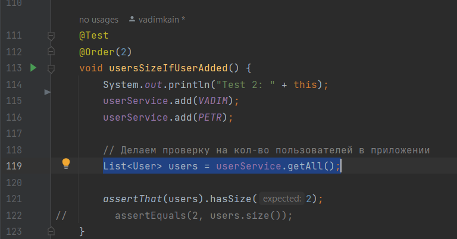

JUnit 5. 20. Behavior Driven Development. BDD
=============================================

На основании методологии **Test Driven Development** есть ещё одна методология, которая называется **Behavior Driven Development** и которая точно так же заключается в том что сначала пишем тесты, а потом уже основной функционал и она рассчитана на улучшение согласования каких-то бизнес-требований и реализацию этих требований программистами. Другими словами говоря - эти тесты пишутся по каким-то сценариям бизнес-аналитиков и понятным нетехническим специалиста. Т.е. понятные обычным пользователям и следовательно, BDD очень хорошо ложится на **acceptance тестирование** (тестирование всего приложения в целом).

На примере наших тестов
-----------------------

В BDD существуют три основных слова:

1.  **given** - то, что дано нам для выполнения наших тестов. Т.е. в данном случае мы разделяли все предыдущие тесты, даны какие-то наши пользователи которые мы инициализируем перед выполнением нашего теста. Часть из этих инициализаций может происходить в методе `@BeforeEach`.

    
2.  **when** - вызов теста, который будем тестировать.

    
3.  **then** - это третья часть, где используем наши ассерты для проверки предыдущего шага. Т.е. когда вызвали наш метод.

В итоге получается цепочка. В BDD тесты называются сценариями и совокупность этих тестов называется story.

Что имеем в итоге:
------------------

Это то, что пишем **Story** какую-ту большую со совокупностью сценариев. Например, на проверку функциональности нашего пользователя и все что с ним связано и каждый тест - это отдельный сценарий в котором есть совокупность методов _given when then_. Для этого есть более специфичные фреймворки для тестирования и в Java один из таких фреймворков - **jbehave** который заключается в том, что у нас есть story, которая разбита на сценарии. Каждый сценарий - это отдельный тест. Естественно такие стори ложатся на классы.

_When then_ могут повторяться, а _given_ иногда нет потому что мы идём по флоу того, как юзер пользуется нашим приложением. Например, пользователь хочет купить какой-то продукт. Следовательно, когда (when) он откроет страницу на нашем сайте, он (then) должен увидеть соответствующую таблицу продуктов. Далее когда (when) набирает в фильтре что именно хочет купить - тогда (then) он должен увидеть только соответствующий тип продуктов.

Т.е. мы **пишем сценарий от конечного пользователя** - то, как он это все видит, а не технический специалист. А мы уже на основании этих сценарий пишем функционал. В **jbehave** есть отличная документация по BDD. Более того, мокито даже предоставляет возможность использовать утилитные методы по созданию stub'ов и прочее, но уже в терминологии BDD. Для этого у нас есть другой класс - `BDDMockito`. Он наследуется от `Mockito`, и дополняет своим функционалом.

**UserServiceTest.java**

        @Test
        void shouldDeleteExistedUser() {
            userService.add(VADIM);

    //        STUB: верни true, когда у userDao вызовем метод delete и передадим туда VADIM.getId()
            Mockito.doReturn(true).when(userDao).delete(VADIM.getId());

    //        Если никакой ид не интересует
    //        Mockito.doReturn(true).when(userDao).delete(Mockito.any());

    //        Mockito.when(userDao.delete(VADIM.getId()))
    //                .thenReturn(true)
    //                .thenReturn(false);

    //        BDDMockito.given(userDao.delete(VADIM.getId())).willReturn(true);
    //
    //        BDDMockito.willReturn(true).given(userDao).delete(VADIM.getId());

            boolean deleteResult = userService.delete(VADIM.getId());
            System.out.println(userService.delete(VADIM.getId()));
            System.out.println(userService.delete(VADIM.getId()));

            ArgumentCaptor<Integer> integerArgumentCaptor = ArgumentCaptor.forClass(Integer.class);

            Mockito.verify(userDao, Mockito.times(3)).delete(integerArgumentCaptor.capture());
    //        getValue() возвращается последнее значение. Ставить в зависимости от того сколько раз отрабатывает метод delete
            assertThat(integerArgumentCaptor.getValue()).isEqualTo(25);

            assertThat(deleteResult).isTrue();
        }